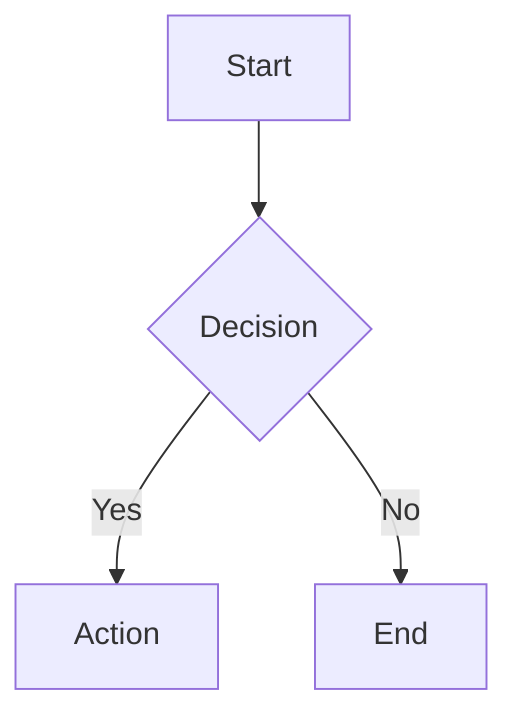

# NoteCraft

A privacy-first, Obsidian-flavored markdown note-taking app built with Next.js 16, CodeMirror 6, and an industrial-grade markdown-it rendering pipeline. All notes live in your browser's localStorage — no server, no tracking, no sign-up.

**Live Demo**: [notecraft-6hl.pages.dev](https://notecraft-6hl.pages.dev)

---

## Features

- **Obsidian-flavored Markdown** — Callouts, embeds, tags, block references, comments, footnotes, math, mermaid diagrams, and more
- **Live Preview** — Split-pane editing with real-time rendered output (150ms debounced) and bidirectional scroll sync
- **Mobile-Ready** — Robust editor with proper keyboard/cursor handling on mobile view mode switches; sidebar auto-closes on note selection
- **Hybrid Rendering** — Obsidian-style Live Preview decorations in the editor (checkboxes, embeds, images, math, links)
- **Obsidian Embeds** — Note transclusions (`![[note]]`) with live resolution and content injection, image embed+resize (`![[img.png|300]]`), heading/block embeds (`![[note#^id]]`); click to navigate or auto-create missing notes
- **Obsidian Tags** — Inline tags (`#tag`, `#nested/tag`) rendered as clickable badges; click to search notes by tag
- **Block References** — Define blocks with `^block-id` and reference them from embeds
- **Front Matter Properties** — YAML front matter rendered as a collapsible properties panel
- **Code-block Admonitions** — `~~~ad-note` syntax as an alternative to blockquote callouts
- **Callout Picker** — Toolbar dropdown with all 14 callout types, so you never have to memorize syntax
- **Syntax Highlighting** — 40+ languages via Shiki (github-light / github-dark themes)
- **Image Upload** — Drag-and-drop, paste, or click to upload (stored as data URLs in localStorage)
- **Command Palette** — Ctrl+K for quick navigation and actions
- **Slash Commands** — Type `/` for a Notion-style insert menu
- **Document Formatting** — Prettier-powered markdown formatting (Ctrl+Shift+F)
- **Dark Mode** — Full light/dark theme support with persistence across sessions
- **Heading Navigation** — Click any heading in preview to jump straight to it in the editor
- **Error Recovery** — React Error Boundary catches rendering crashes with a retry UI
- **Inline AI Suggestions** — Ghost text with Tab-to-accept, wired and ready for any AI backend
- **Heading Slug Panel** — Set heading IDs via an inline panel instead of browser `prompt()`
- **XSS-Safe** — All output sanitized through DOMPurify with a carefully curated allowlist (no iframe)
- **Rendering Indicator** — Visual spinner when the preview is re-rendering
- **Zero Backend** — Everything runs client-side, persisted to localStorage via Zustand

---

## Architecture Overview

```
┌─────────────────────────────────────────────────────────────────┐
│                        NoteCraft App                            │
│                                                                 │
│  ┌──────────┐   ┌──────────────────┐   ┌─────────────────────┐ │
│  │  Sidebar  │   │   CodeMirror 6   │   │  Markdown Preview   │ │
│  │          │   │                  │   │                     │ │
│  │ • Notes  │   │ ┌──────────────┐ │   │  markdown-it        │ │
│  │ • Search │   │ │  Toolbar     │ │   │  + 23 plugins       │ │
│  │ • CRUD   │   │ │ (React Portal)│ │   │  + DOMPurify        │ │
│  │          │   │ ├──────────────┤ │   │  + Shiki             │ │
│  │          │   │ │  Editor      │ │   │  + Medium-zoom       │ │
│  │          │   │ │  + Hybrid    │ │   │  + Mermaid (lazy)    │ │
│  │          │   │ │    Render    │ │   │                     │ │
│  └──────────┘   │ │  + AI Ghost │ │   └─────────────────────┘ │
│                  │ │  + Slug     │ │          ▲                │
│                  │ └──────────────┘ │          │ scroll sync   │
│                  └──────────────────┘          │ (split view)  │
│                            │                    │               │
│                    Zustand Store                │               │
│                    (localStorage)               │               │
└─────────────────────────────────────────────────────────────────┘
```

### Rendering Pipeline

```
Markdown text
     │
     ▼
┌──────────────────────────────┐
│  markdown-it + 23 plugins    │  Step 1: Parse + Render
│  (see Rendering Pipeline     │
│   section below)             │
└──────────────┬───────────────┘
               │
               ▼
┌──────────────────────────────┐
│  DOMPurify Sanitization      │  Step 2: XSS-safe output
│  (120+ allowed tags,         │
│   70+ allowed attrs)         │
└──────────────┬───────────────┘
               │
               ▼
┌──────────────────────────────┐
│  Shiki Syntax Highlighting   │  Step 3: Async post-processing
│  (40 languages,              │
│   github-light/dark)         │
└──────────────┬───────────────┘
               │
               ▼
┌──────────────────────────────┐
│  Post-Render                 │  Step 4: Client-side enhancements
│  • Medium-zoom (images)      │
│  • Mermaid (diagrams)        │
│  • Embed resolution          │
│  • Event delegation          │
│  • Front matter display      │
└──────────────────────────────┘
```

---

## Rendering Pipeline — 23 Plugins

NoteCraft uses **markdown-it** as its rendering engine with a plugin pipeline that combines the best of the markdown-it ecosystem with algorithms backported from the Remark/Astro ecosystem. The principle: *markdown-it is the engine, Remark is the reference implementation* — we study how Remark plugins handle edge cases, then implement the same logic in markdown-it's token stream model.

### NPM Plugins

| # | Plugin | Version | Syntax | Description |
|---|--------|---------|--------|-------------|
| 1 | [`markdown-it-front-matter`](https://github.com/parksb/markdown-it-front-matter) | ^0.2.4 | `---\ntitle: ...\n---` | YAML front matter extraction |
| 2 | [`markdown-it-task-lists`](https://github.com/revin/markdown-it-task-lists) | ^2.1.1 | `- [ ] task` | GFM task lists with checkboxes |
| 3 | [`markdown-it-footnote`](https://github.com/markdown-it/markdown-it-footnote) | ^4.0.0 | `[^1]` | Footnotes with references |
| 4 | [`markdown-it-sub`](https://github.com/markdown-it/markdown-it-sub) | ^2.0.0 | `H~2~O` | Subscript text |
| 5 | [`markdown-it-sup`](https://github.com/markdown-it/markdown-it-sup) | ^2.0.0 | `E=mc^2^` | Superscript text |
| 6 | [`markdown-it-mark`](https://github.com/markdown-it/markdown-it-mark) | ^4.0.0 | `==highlight==` | Highlighted text |
| 7 | [`markdown-it-attrs`](https://github.com/arve0/markdown-it-attrs) | ^5.0.0 | `{.class #id}` | Custom attributes on elements |
| 8 | [`markdown-it-emoji`](https://github.com/markdown-it/markdown-it-emoji) | ^3.0.0 | `:rocket:` → 🚀 | Emoji shortcuts (full Unicode set) |
| 9 | [`markdown-it-deflist`](https://github.com/markdown-it/markdown-it-deflist) | ^3.0.1 | `Term\n: Definition` | Definition lists |
| 10 | [`@traptitech/markdown-it-katex`](https://github.com/traptitech/markdown-it-katex) | ^3.6.0 | `$...$` / `$$...$$` | KaTeX math rendering |

### Custom Plugins (built in-house)

All Obsidian-specific transforms (comments, embeds, tags, callouts, block references) are consolidated into a single [`obsidian-transforms.ts`](src/lib/renderer/obsidian-transforms.ts) core rule that performs one inline walk and block-level transforms in a single pass for maximum performance.

| # | Plugin | File | Syntax | Description |
|---|--------|------|--------|-------------|
| 11 | **Obsidian Transforms** | [`obsidian-transforms.ts`](src/lib/renderer/obsidian-transforms.ts) | `%%comment%%`, `![[note]]`, `#tag`, `> [!note]`, `^block-id` | Merged core rule: comment stripping → embed resolution → tag rendering (inline sub-passes), then callout + block-ref transforms (block level) |
| 12 | **Mermaid Plugin** | [`mermaid-plugin.ts`](src/lib/renderer/mermaid-plugin.ts) | ` ```mermaid ` | Lazy-load placeholder pattern for client-side rendering |
| 13 | **Heading ID Plugin** | [`heading-id-plugin.ts`](src/lib/renderer/heading-id-plugin.ts) | `## Heading {#custom-id}` | GitHub-slugger compatible heading anchors with deduplication |
| 14 | **Admonition Plugin** | [`admonition-plugin.ts`](src/lib/renderer/admonition-plugin.ts) | `~~~ad-note` | Code-block admonitions with 14 canonical types |
| 15 | **Front Matter Display** | [`frontmatter-display.ts`](src/lib/renderer/frontmatter-display.ts) | YAML → `<details>` panel | Collapsible properties panel with type-aware styling |

### Post-Processing Pipeline (not markdown-it plugins)

| # | Component | Package | Description |
|---|-----------|---------|-------------|
| 16 | **Syntax Highlighting** | [`shiki`](https://github.com/shikijs/shiki) ^4.2.0 | Async code highlighting, 40 languages, github-light/dark themes |
| 17 | **XSS Sanitization** | [`dompurify`](https://github.com/cure53/DOMPurify) ^3.4.9 | 120+ allowed tags, 70+ allowed attrs, custom data-attributes, no iframe |
| 18 | **Image Zoom** | [`medium-zoom`](https://github.com/francoischalifour/medium-zoom) ^1.1.0 | Click-to-zoom on preview images |
| 19 | **Embed Resolution** | — | Client-side: finds matching notes and injects rendered content into embed placeholders |
| 20 | **Mermaid Rendering** | [`mermaid`](https://github.com/mermaid-js/mermaid) ^11.15.0 | Lazy-loaded diagram rendering with strict security level |
| 21 | **Event Delegation** | — | Interactive click handlers: tag → search, embed → navigate/create, task toggle, heading jump to editor |
| 22 | **Code Copy Button** | — | Click-to-copy on all code blocks with toast feedback |
| 23 | **Rendering Indicator** | — | Visual spinner overlay during async render cycles |

---

## Custom Plugins — Deep Dive

### Obsidian Transforms (Merged Core Rule)

The heart of Obsidian compatibility. A single core rule `obsidian_transforms` runs after the `inline` parse phase and performs all Obsidian-specific transforms in one pass:

**Inline sub-passes** (one walk through all text tokens):
1. **Comment stripping** — `%%hidden%%` content is removed from output
2. **Embed rendering** — `![[note]]`, `![[image.png|300]]`, `![[note#^blockid]]` patterns are replaced with styled embed containers with data attributes for client-side resolution
3. **Tag rendering** — `#tag`, `#nested/tag` patterns are rendered as clickable `<a>` badges with context-aware parsing (no false positives on headings or code)

**Block-level transforms:**
4. **Callout rendering** — `> [!note] Title` blockquotes are transformed into styled callout divs, with foldable support via `<details>/<summary>`, 14 canonical types with 18 aliases
5. **Block reference handling** — `^block-id` definitions are attached to their parent blocks as `data-block-id` attributes

**What was backported from the Remark ecosystem:**
- **From [`@r4ai/remark-callout`](https://github.com/r4ai/remark-callout):** The `parseCallout` regex, foldable `<details>/<summary>` rendering, auto-capitalize type-as-title
- **From [`flowershow/remark-callouts`](https://github.com/flowershow/remark-callouts):** Type alias mapping system
- **From [`remark-obsidian-callout`](https://github.com/MoritzRS/remark-obsidian-callout):** Data attributes for CSS targeting
- **From [`remark-obsidian-md`](https://github.com/MoritzRS/remark-obsidian-md):** Foldable chevron indicators, embed rendering pattern, frontmatter display
- **From [`@moritzrs/remark-ofm`](https://github.com/MoritzRS/remark-ofm):** Context-aware tag detection algorithm
- **From [`@heavycircle/remark-obsidian`](https://github.com/heavycircle/remark-obsidian):** Block reference syntax and embed handling
- **From [`markdown-it-hashtag`](https://github.com/svbergerhem/markdown-it-hashtag):** Text node scanning approach for tags

---

### Mermaid Plugin

Detects `mermaid` fenced code blocks and emits a placeholder container for client-side lazy rendering.

**Syntax:**

````markdown

````

**Security:** Mermaid is initialized with `securityLevel: 'strict'` to prevent arbitrary HTML/JS injection in diagrams. IDs use deterministic counters instead of `Math.random()`.

**Architecture:** Intercepts the `fence` renderer for `mermaid` language blocks, emits `<div class="mermaid-container" data-mermaid-source="...">` with an SVG loading placeholder. The React preview component lazily imports the `mermaid` package and renders SVG diagrams into these containers.

---

### Heading ID Plugin

Auto-generates GitHub-style slug IDs for all headings, with deduplication support.

**Syntax:**

```markdown
## Introduction {#custom-id}
## Another Heading    <!-- auto-generates id="another-heading" -->
```

**Architecture:** Overrides the `heading_open` renderer, generates a slug from inline content using a custom algorithm (strip HTML → remove non-word → lowercase → spaces to hyphens → collapse hyphens), deduplicates via an `env.__headingSlugs` Map that appends `-1`, `-2`, etc. Custom IDs via `{#id}` attribute syntax are preserved with priority. Uses [`github-slugger`](https://github.com/Flet/github-slugger) internally.

---

### Admonition Plugin

Provides code-block style admonitions as an alternative to the blockquote callout syntax.

**Syntax:**

````markdown
~~~ad-note
Title: Important Note
Content here with **markdown** support
~~~
````

**14 Recognized Types (shared with callout plugin):**

| Type | Icon | Aliases |
|------|------|---------|
| `note` | ✎ | — |
| `info` | ℹ | — |
| `tip` | ☝ | `hint` |
| `success` | ✔ | `check`, `done` |
| `question` | ❓ | `help`, `faq` |
| `warning` | ⚠ | `caution`, `attention` |
| `failure` | ✘ | `fail`, `missing` |
| `danger` | ⛔ | `error` |
| `bug` | 🐛 | — |
| `example` | 📋 | — |
| `quote` | ❝ | `cite` |
| `abstract` | 📑 | `summary`, `tldr` |
| `todo` | 📝 | — |
| `important` | 🔥 | — |

---

### Front Matter Display

Renders YAML front matter as a collapsible properties panel at the top of the document, mirroring Obsidian's reading mode properties view.

**Rendered output:** A `<details open>` panel containing a table of key-value pairs, with type-aware styling for each value type:

| Value Type | CSS Class | Example |
|-----------|-----------|---------|
| String | `.frontmatter-string` | `My Note` |
| Number | `.frontmatter-number` | `3` |
| Boolean | `.frontmatter-boolean` | `true` |
| Date | `.frontmatter-date` | `2025-01-15` |
| Array | `.frontmatter-array` → `.frontmatter-tag` | `[productivity, ideas]` |
| Null | `.frontmatter-null` | `null` |
| Empty array | `.frontmatter-empty` | `[]` |

---

## CodeMirror 6 Extensions

NoteCraft builds a rich set of CodeMirror 6 extensions, some based on existing open-source projects with improvements, and some entirely original.

### Based on Existing Projects

| Extension | Based On | Changes |
|-----------|----------|---------|
| **Markdown Commands** | [`yeliex/codemirror-markdown-commands`](https://github.com/yeliex/codemirror-markdown-commands) | Added toggle support (wrap/unwrap), smart cursor placement, heading cycling, document formatting |
| **Toolbar** | [`yeliex/codemirror-toolbar`](https://github.com/yeliex/codemirror-toolbar) | Replaced static DOM with React portal, Lucide icons, shadcn/ui dropdown menus, callout picker |
| **Image Upload** | [`yeliex/codemirror-markdown-image`](https://github.com/yeliex/codemirror-markdown-image) | Enhanced with progress tracking, drag-and-drop, paste-to-upload, linter for upload status |
| **Inline Suggestion** | [`rizerphe/codemirror-companion-extension`](https://github.com/rizerphe/codemirror-companion-extension) | Stabilized API, instance-level debounce, Tab accept, Escape dismiss — wired with no-op fetchFn, ready for any AI backend |
| **Final Newline** | [`yeliex/codemirror-final-newline`](https://github.com/yeliex/codemirror-final-newline) | Configurable with focus-only mode |

### Original Extensions

| Extension | Description |
|-----------|-------------|
| **Slash Commands** | Notion-style `/` menu built on [`@codemirror/autocomplete`](https://github.com/codemirror/autocomplete) — type `/` to insert any block element, heading, list, or callout |
| **Hybrid Render** | Obsidian-style Live Preview using CM6 Decoration API — 5 decoration types: interactive checkboxes, embeds, image thumbnails, math preview, styled links |
| **Heading Slug Utilities** | Copy/set/remove heading IDs, jump-to-heading by slug, document heading scanner |
| **Slug Input Panel** | CM6 panel-based heading ID input UI (replaces browser `prompt()`) with Enter/Escape keyboard support |
| **Lezer Grammar Extensions** | Custom syntax highlighting for Obsidian-flavored markdown: callouts, comments, embeds, tags, block references, front matter |
| **Editor Theme** | BaseTheme for toolbar container, autocomplete dropdowns, and hybrid render decorations |

---

## Toolbar

The formatting toolbar is rendered as a React portal inside CodeMirror's DOM, providing native-feeling integration with the editor.

### Default Toolbar Buttons

| Group | Buttons |
|-------|---------|
| **Inline** | Bold (Ctrl+B), Italic (Ctrl+I), Strikethrough, Inline Code (Ctrl+\`), Underline, Highlight |
| **Headings** | H1, H2, H3, H4 |
| **Blocks** | Block Quote, **Callout Picker** ▾, Bullet List, Numbered List, To-Do List |
| **Inserts** | Link, Image, Upload Image (Ctrl+Shift+I), Code Block, Table, Horizontal Rule |
| **Format** | Format Document (Ctrl+Shift+F) |

### Callout Picker

The callout picker is a dropdown menu (built with [shadcn/ui DropdownMenu](https://ui.shadcn.com/docs/components/dropdown-menu)) that shows all 14 callout types with their icons and colored labels. Selecting a type:

1. **With no text selected** — Inserts a callout template with cursor on the empty content line
2. **With text selected** — Wraps the selected text as the callout body

---

## Security

All rendered HTML passes through DOMPurify with a carefully curated allowlist:

- **120+ allowed tags** — Standard HTML, KaTeX MathML, Mermaid SVG elements (no `iframe`)
- **70+ allowed attributes** — Including `aria-*` and `data-*` wildcards
- **Custom data attributes** — `data-mermaid-source`, `data-callout`, `data-callout-foldable`, `data-callout-collapsed`, `data-admonition`, `data-code`, `data-lang`, `data-tag`, `data-embed-src`, `data-embed-type`, `data-embed-heading`, `data-embed-block`, `data-embed-placeholder`, `data-block-id`
- **Data URI support** — Allowed for `` tags (base64 uploads)
- **Mermaid strict mode** — `securityLevel: 'strict'` prevents arbitrary HTML in diagrams
- **Lazy DOMPurify loading** — Uses `require('dompurify')` to avoid `jsdom` dependency on Cloudflare Workers edge runtime

---

## Keyboard Shortcuts

| Shortcut | Action |
|----------|--------|
| `Ctrl+N` | Create new note |
| `Ctrl+B` | Toggle sidebar / Bold (in editor) |
| `Ctrl+K` | Open command palette |
| `Ctrl+\` | Cycle view mode (edit → preview → split) |
| `Ctrl+=` / `Ctrl++` | Increase font size |
| `Ctrl+-` | Decrease font size |
| `Ctrl+Shift+F` | Format document (Prettier) |
| `Ctrl+I` | Italic |
| `Ctrl+`` ` | Inline code |
| `Ctrl+Shift+I` | Upload image |
| `/` | Open slash command menu |

---

## Tech Stack

| Category | Technology |
|----------|------------|
| Framework | [Next.js 16](https://nextjs.org/) (App Router, Turbopack) |
| UI | [React 19](https://react.dev/), [shadcn/ui](https://ui.shadcn.com/) (New York style, [Radix UI](https://www.radix-ui.com/)), [Tailwind CSS 4](https://tailwindcss.com/) |
| Icons | [Lucide React](https://lucide.dev/) |
| Editor | [CodeMirror 6](https://codemirror.net/) |
| Renderer | [markdown-it](https://github.com/markdown-it/markdown-it) ^14.2.0 |
| Math | [KaTeX](https://katex.org/) via [@traptitech/markdown-it-katex](https://github.com/traptitech/markdown-it-katex) |
| Diagrams | [Mermaid](https://mermaid.js.org/) ^11.15.0 (lazy-loaded, strict security) |
| Code Highlighting | [Shiki](https://shiki.style/) ^4.2.0 (github-light / github-dark) |
| Sanitization | [DOMPurify](https://github.com/cure53/DOMPurify) ^3.4.9 |
| State | [Zustand](https://zustand.docs.pmnd.rs/) ^5.0.6 (persist middleware → localStorage) |
| Formatting | [Prettier](https://prettier.io/) ^3.8.4 (built-in markdown parser) |
| Deployment | [Cloudflare Pages](https://pages.cloudflare.com/) via [OpenNext](https://opennext.js.org/) |
| Hosting | GitHub → [chatbot-x/notecraft](https://github.com/chatbot-x/notecraft) |

---

## Project Structure

```
src/
├── app/
│   ├── globals.css              # Global styles + callout/tag/embed/frontmatter CSS + code block CSS
│   ├── layout.tsx               # Root layout with theme provider
│   └── page.tsx                 # Entry point with Error Boundary wrapper
├── components/
│   ├── editor.tsx               # CodeMirror 6 editor with all extensions
│   ├── markdown-preview.tsx     # Preview panel (client-only, ssr: false)
│   ├── note-app.tsx             # Main app layout (sidebar + editor + preview + scroll sync)
│   ├── sidebar.tsx              # Note list, search, CRUD
│   ├── command-palette.tsx      # Ctrl+K command palette
│   ├── error-boundary.tsx       # React Error Boundary for crash recovery
│   └── ui/                      # shadcn/ui components
├── lib/
│   ├── renderer/
│   │   ├── index.ts             # Main rendering pipeline (renderMarkdown, renderMarkdownSync)
│   │   ├── obsidian-transforms.ts # Merged Obsidian core rule (comments, embeds, tags, callouts, block-refs)
│   │   ├── callout-types.ts     # Shared callout type definitions and aliases
│   │   ├── admonition-plugin.ts # Code-block admonition plugin (~~~ad-note)
│   │   ├── frontmatter-display.ts # Front matter properties panel renderer
│   │   ├── heading-id-plugin.ts # Custom heading anchor plugin
│   │   ├── mermaid-plugin.ts    # Custom Mermaid placeholder plugin
│   │   ├── code-highlighter.ts  # Shiki async post-processor
│   │   └── obsidian-transforms.test.ts # Integration tests for obsidian transforms
│   ├── codemirror-ext/
│   │   ├── index.ts             # Barrel export
│   │   ├── commands/index.ts    # Markdown editing commands
│   │   ├── toolbar/             # React portal toolbar + callout picker
│   │   ├── slash/index.ts       # Slash commands
│   │   ├── image/index.ts       # Image upload with drag-drop-paste
│   │   ├── inline-suggestion/   # AI ghost text suggestions
│   │   ├── hybrid-render/       # Obsidian Live Preview decorations
│   │   ├── slug/index.ts        # Heading slug utilities + panel-based input UI
│   │   ├── lezer-extensions/    # Obsidian-flavored Markdown Lezer grammar
│   │   ├── theme/index.ts       # Editor theme
│   │   └── final-newline/       # Trailing newline enforcement
│   ├── store.ts                 # Zustand store (notes, settings, dark mode, hydration)
│   ├── utils.ts                 # Utility functions + dev-only logger
│   └── image-upload.ts          # Image data URL handler
└── public/                      # Static assets
```

---

## References & Credits

### Rendering Engine

- [`markdown-it`](https://github.com/markdown-it/markdown-it) — Fast and extensible Markdown parser
- [`@traptitech/markdown-it-katex`](https://github.com/traptitech/markdown-it-katex) — KaTeX math rendering
- [`markdown-it-footnote`](https://github.com/markdown-it/markdown-it-footnote) — Footnote syntax
- [`markdown-it-task-lists`](https://github.com/revin/markdown-it-task-lists) — GFM task lists
- [`markdown-it-sub`](https://github.com/markdown-it/markdown-it-sub) / [`markdown-it-sup`](https://github.com/markdown-it/markdown-it-sup) — Subscript/superscript
- [`markdown-it-mark`](https://github.com/markdown-it/markdown-it-mark) — Highlighted text
- [`markdown-it-attrs`](https://github.com/arve0/markdown-it-attrs) — Custom attributes
- [`markdown-it-emoji`](https://github.com/markdown-it/markdown-it-emoji) — Emoji shortcuts
- [`markdown-it-deflist`](https://github.com/markdown-it/markdown-it-deflist) — Definition lists
- [`markdown-it-front-matter`](https://github.com/parksb/markdown-it-front-matter) — YAML front matter

### Remark Ecosystem (Backport Sources)

- [`@r4ai/remark-callout`](https://github.com/r4ai/remark-callout) — Callout regex, foldable `<details>/<summary>`
- [`flowershow/remark-callouts`](https://github.com/flowershow/remark-callouts) — Type alias mapping
- [`remark-obsidian-callout`](https://github.com/MoritzRS/remark-obsidian-callout) — Data attributes
- [`remark-obsidian-md`](https://github.com/MoritzRS/remark-obsidian-md) — Foldable chevron, embeds, frontmatter
- [`@moritzrs/remark-ofm`](https://github.com/MoritzRS/remark-ofm) — OFM tags
- [`@heavycircle/remark-obsidian`](https://github.com/heavycircle/remark-obsidian) — Block references
- [`ebullient/markdown-it-obsidian-callouts`](https://github.com/ebullient/markdown-it-obsidian-callouts) — Admonitions
- [`markdown-it-hashtag`](https://github.com/svbergerhem/markdown-it-hashtag) — Tag text scanning

### CodeMirror Ecosystem

- [`@codemirror/autocomplete`](https://github.com/codemirror/autocomplete) — Slash commands
- [`@codemirror/lang-markdown`](https://github.com/codemirror/lang-markdown) — Markdown language support
- [`codemirror-lang-mermaid`](https://github.com/yaegassy/codemirror-lang-mermaid) — Mermaid syntax highlighting
- [`codemirror-markdown-tables`](https://github.com/artisticat8/codemirror-markdown-tables) — Interactive tables
- [`yeliex/codemirror-markdown-commands`](https://github.com/yeliex/codemirror-markdown-commands) — Toggle-aware commands
- [`yeliex/codemirror-toolbar`](https://github.com/yeliex/codemirror-toolbar) — Toolbar container pattern
- [`yeliex/codemirror-markdown-image`](https://github.com/yeliex/codemirror-markdown-image) — Image upload workflow
- [`rizerphe/codemirror-companion-extension`](https://github.com/rizerphe/codemirror-companion-extension) — Inline suggestion pattern
- [`yeliex/codemirror-final-newline`](https://github.com/yeliex/codemirror-final-newline) — Trailing newline

### Post-Processing & Infrastructure

- [`shiki`](https://github.com/shikijs/shiki) — Syntax highlighting
- [`DOMPurify`](https://github.com/cure53/DOMPurify) — XSS sanitization
- [`medium-zoom`](https://github.com/francoischalifour/medium-zoom) — Image zoom
- [`mermaid`](https://github.com/mermaid-js/mermaid) — Diagram rendering
- [`KaTeX`](https://github.com/KaTeX/KaTeX) — Math typesetting
- [`github-slugger`](https://github.com/Flet/github-slugger) — Heading slug generation
- [`Prettier`](https://github.com/prettier/prettier) — Code formatter
- [`framer-motion`](https://github.com/motiondivision/motion) — UI animations

### UI & Framework

- [`Next.js`](https://github.com/vercel/next.js) — React framework
- [`shadcn/ui`](https://ui.shadcn.com/) — UI component library
- [`Radix UI`](https://www.radix-ui.com/) — Primitive UI components
- [`Tailwind CSS`](https://github.com/tailwindlabs/tailwindcss) — Utility-first CSS
- [`Lucide`](https://github.com/lucide-icons/lucide) — Icon library
- [`Zustand`](https://github.com/pmndrs/zustand) — State management

---

## License

MIT
