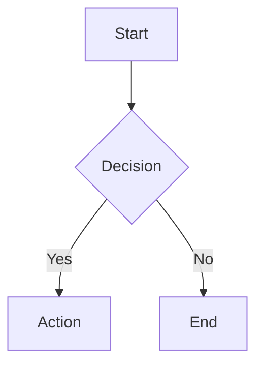

# NoteCraft

A privacy-first, Obsidian-flavored markdown note-taking app built with Next.js 16, CodeMirror 6, and an industrial-grade markdown-it rendering pipeline. All notes live in your browser's localStorage — no server, no tracking, no sign-up.

**Live Demo**: [notecraft-6hl.pages.dev](https://notecraft-6hl.pages.dev)

---

## Features

- **Obsidian-flavored Markdown** — Callouts, wikilinks, comments, footnotes, math, mermaid diagrams, and more
- **Live Preview** — Split-pane editing with real-time rendered output (150ms debounced)
- **Hybrid Rendering** — Obsidian-style Live Preview decorations in the editor (checkboxes, wikilinks, images, math, links)
- **Callout Picker** — Toolbar dropdown with all 14 callout types, so you never have to memorize syntax
- **Syntax Highlighting** — 40+ languages via Shiki (github-light / github-dark themes)
- **Image Upload** — Drag-and-drop, paste, or click to upload (stored as data URLs in localStorage)
- **Command Palette** — Ctrl+K for quick navigation and actions
- **Slash Commands** — Type `/` for a Notion-style insert menu
- **Document Formatting** — Prettier-powered markdown formatting (Ctrl+Shift+F)
- **Dark Mode** — Full light/dark theme support across editor and preview
- **XSS-Safe** — All output sanitized through DOMPurify with a carefully curated allowlist
- **Zero Backend** — Everything runs client-side, persisted to localStorage via Zustand

---

## Architecture Overview

```
┌─────────────────────────────────────────────────────────────────┐
│                        NoteCraft App                            │
│                                                                 │
│  ┌──────────┐   ┌──────────────────┐   ┌─────────────────────┐ │
│  │  Sidebar  │   │   CodeMirror 6   │   │  Markdown Preview   │ │
│  │          │   │                  │   │                     │ │
│  │ • Notes  │   │ ┌──────────────┐ │   │  markdown-it        │ │
│  │ • Search │   │ │  Toolbar     │ │   │  + 18 plugins       │ │
│  │ • CRUD   │   │ │ (React Portal)│ │   │  + DOMPurify        │ │
│  │          │   │ ├──────────────┤ │   │  + Shiki             │ │
│  │          │   │ │  Editor      │ │   │  + Medium-zoom       │ │
│  │          │   │ │  + Hybrid    │ │   │  + Mermaid (lazy)    │ │
│  │          │   │ │    Render    │ │   │                     │ │
│  └──────────┘   │ └──────────────┘ │   └─────────────────────┘ │
│                  └──────────────────┘                            │
│                            │                                    │
│                    Zustand Store                                │
│                    (localStorage)                               │
└─────────────────────────────────────────────────────────────────┘
```

### Rendering Pipeline

```
Markdown text
     │
     ▼
┌──────────────────────────────┐
│  markdown-it + 18 plugins    │  Step 1: Parse + Render
│  (see Rendering Pipeline     │
│   section below)             │
└──────────────┬───────────────┘
               │
               ▼
┌──────────────────────────────┐
│  DOMPurify Sanitization      │  Step 2: XSS-safe output
│  (118 allowed tags,          │
│   63 allowed attrs)          │
└──────────────┬───────────────┘
               │
               ▼
┌──────────────────────────────┐
│  Shiki Syntax Highlighting   │  Step 3: Async post-processing
│  (40 languages,              │
│   github-light/dark)         │
└──────────────┬───────────────┘
               │
               ▼
┌──────────────────────────────┐
│  Post-Render                 │  Step 4: Client-side enhancements
│  • Medium-zoom (images)      │
│  • Mermaid (diagrams)        │
│  • Event delegation          │
└──────────────────────────────┘
```

---

## Rendering Pipeline — 18 Plugins

NoteCraft uses **markdown-it** as its rendering engine with a plugin pipeline that combines the best of the markdown-it ecosystem with algorithms backported from the Remark/Astro ecosystem. The principle: *markdown-it is the engine, Remark is the reference implementation* — we study how Remark plugins handle edge cases, then implement the same logic in markdown-it's token stream model.

### NPM Plugins

| # | Plugin | Version | Syntax | Description |
|---|--------|---------|--------|-------------|
| 1 | [`markdown-it-front-matter`](https://github.com/parksb/markdown-it-front-matter) | ^0.2.4 | `---\ntitle: ...\n---` | YAML front matter extraction |
| 2 | [`markdown-it-task-lists`](https://github.com/revin/markdown-it-task-lists) | ^2.1.1 | `- [ ] task` | GFM task lists with checkboxes |
| 3 | [`markdown-it-footnote`](https://github.com/markdown-it/markdown-it-footnote) | ^4.0.0 | `[^1]` | Footnotes with references |
| 4 | [`markdown-it-sub`](https://github.com/markdown-it/markdown-it-sub) | ^2.0.0 | `H~2~O` | Subscript text |
| 5 | [`markdown-it-sup`](https://github.com/markdown-it/markdown-it-sup) | ^2.0.0 | `E=mc^2^` | Superscript text |
| 6 | [`markdown-it-mark`](https://github.com/markdown-it/markdown-it-mark) | ^4.0.0 | `==highlight==` | Highlighted text |
| 7 | [`markdown-it-attrs`](https://github.com/arve0/markdown-it-attrs) | ^5.0.0 | `{.class #id}` | Custom attributes on elements |
| 8 | [`markdown-it-emoji`](https://github.com/markdown-it/markdown-it-emoji) | ^3.0.0 | `:rocket:` → 🚀 | Emoji shortcuts (full Unicode set) |
| 9 | [`markdown-it-deflist`](https://github.com/markdown-it/markdown-it-deflist) | ^3.0.1 | `Term\n: Definition` | Definition lists |
| 10 | [`@traptitech/markdown-it-katex`](https://github.com/traptitech/markdown-it-katex) | ^3.6.0 | `$...$` / `$$...$$` | KaTeX math rendering |
| 11 | [`markdown-it-wikilinks`](https://github.com/jsepia/markdown-it-wikilinks) | ^1.4.0 | `[[note name]]` | Obsidian-style wikilinks |

### Custom Plugins (built in-house, backported from Remark ecosystem)

| # | Plugin | File | Syntax | Backported From |
|---|--------|------|--------|-----------------|
| 12 | **Callout Plugin** | [`callout-plugin.ts`](src/lib/renderer/callout-plugin.ts) | `> [!note] Title` | [`@r4ai/remark-callout`](https://github.com/r4ai/remark-callout) — regex, foldable `<details>/<summary>`, data attributes; [`flowershow/remark-callouts`](https://github.com/flowershow/remark-callouts) — type aliases; [`remark-obsidian-callout`](https://github.com/MoritzRS/remark-obsidian-callout) — data attributes; [`remark-obsidian-md`](https://github.com/MoritzRS/remark-obsidian-md) — foldable chevron |
| 13 | **Comment Plugin** | [`comment-plugin.ts`](src/lib/renderer/comment-plugin.ts) | `%%hidden%%` | Original — Obsidian `%%comment%%` behavior |
| 14 | **Mermaid Plugin** | [`mermaid-plugin.ts`](src/lib/renderer/mermaid-plugin.ts) | ` ```mermaid ` | Original — lazy-load placeholder pattern |
| 15 | **Heading ID Plugin** | [`heading-id-plugin.ts`](src/lib/renderer/heading-id-plugin.ts) | `## Heading {#custom-id}` | Original — mirrors [`github-slugger`](https://github.com/Flet/github-slugger) algorithm |

### Post-Processing Pipeline (not markdown-it plugins)

| # | Component | Package | Description |
|---|-----------|---------|-------------|
| 16 | **Syntax Highlighting** | [`shiki`](https://github.com/shikijs/shiki) ^4.2.0 | Async code highlighting, 40 languages, github-light/dark themes |
| 17 | **XSS Sanitization** | [`dompurify`](https://github.com/cure53/DOMPurify) ^3.4.9 | 118 allowed tags, 63 allowed attrs, custom data-attributes |
| 18 | **Image Zoom** | [`medium-zoom`](https://github.com/francoischalifour/medium-zoom) ^1.1.0 | Click-to-zoom on preview images |

---

## Custom Plugins — Deep Dive

### Callout Plugin

The crown jewel of our custom plugin work. Implements Obsidian-style callouts with full feature parity to the Remark ecosystem implementations.

**Syntax:**

```markdown
> [!note] Simple note
> Content here

> [!warning]+ Foldable (starts open)
> Can be collapsed by clicking

> [!danger]- Foldable (starts closed)
> Can be expanded by clicking
```

**14 Recognized Types:**

| Type | Icon | Aliases |
|------|------|---------|
| `note` | ✎ | — |
| `info` | ℹ | — |
| `tip` | ☝ | `hint` |
| `success` | ✔ | `check`, `done` |
| `question` | ❓ | `help`, `faq` |
| `warning` | ⚠ | `caution`, `attention` |
| `failure` | ✘ | `fail`, `missing` |
| `danger` | ⛔ | `error` |
| `bug` | 🐛 | — |
| `example` | 📋 | — |
| `quote` | ❝ | `cite` |
| `abstract` | 📑 | `summary`, `tldr` |
| `todo` | 📝 | — |
| `important` | 🔥 | — |

**What was backported:**

- **From [`@r4ai/remark-callout`](https://github.com/r4ai/remark-callout):** The `parseCallout` regex (`/^\[!([^\]]+)\]([+-]?)(?:[ \t]+(.*))?/`), foldable callout rendering via native `<details>/<summary>` HTML elements, and the auto-capitalize type-as-title behavior
- **From [`flowershow/remark-callouts`](https://github.com/flowershow/remark-callouts):** The type alias mapping system (18 aliases resolving to 14 canonical types)
- **From [`remark-obsidian-callout`](https://github.com/MoritzRS/remark-obsidian-callout):** Data attributes (`data-callout-foldable`, `data-callout-collapsed`) for CSS targeting and programmatic access
- **From [`remark-obsidian-md`](https://github.com/MoritzRS/remark-obsidian-md):** Foldable chevron indicator characters (▸ for collapsed, ▾ for expanded)

**Architecture:** Registers a `callout` core rule after `inline` that scans the parsed token stream for `blockquote_open` sequences. If the first inline content starts with `[!TYPE]`, the blockquote is transformed in-place into a styled callout `<div>` (or `<details>/<summary>` for foldable). Regular blockquotes without the marker are left untouched.

---

### Comment Plugin

Strips or hides Obsidian-style inline comments from rendered output.

**Syntax:**

```markdown
This is visible %%this is hidden%% and this is visible too
```

**Options:**
- `strip: true` (default) — Remove `%%...%%` content entirely
- `strip: false` — Wrap in HTML comment `<!-- ... -->` (visible in source, not rendered)

**Architecture:** Core rule after `inline`, scans text children for `%%...%%` pattern using regex, splits text nodes and either removes or wraps matched content.

---

### Mermaid Plugin

Detects `mermaid` fenced code blocks and emits a placeholder container for client-side lazy rendering.

**Syntax:**

````markdown

````

**Architecture:** Intercepts the `fence` renderer for `mermaid` language blocks, emits `<div class="mermaid-container" data-mermaid-source="...">` with an SVG loading placeholder. The React preview component lazily imports the `mermaid` package and renders SVG diagrams into these containers.

---

### Heading ID Plugin

Auto-generates GitHub-style slug IDs for all headings, with deduplication support.

**Syntax:**

```markdown
## Introduction {#custom-id}
## Another Heading    <!-- auto-generates id="another-heading" -->
```

**Architecture:** Overrides the `heading_open` renderer, generates a slug from inline content using a custom algorithm (strip HTML → remove non-word → lowercase → spaces to hyphens → collapse hyphens), deduplicates via an `env.__headingSlugs` Map that appends `-1`, `-2`, etc. Custom IDs via `{#id}` attribute syntax are preserved with priority. Uses [`github-slugger`](https://github.com/Flet/github-slugger) internally.

---

## CodeMirror 6 Extensions

NoteCraft builds a rich set of CodeMirror 6 extensions, some based on existing open-source projects with improvements, and some entirely original.

### Based on Existing Projects

| Extension | Based On | Changes |
|-----------|----------|---------|
| **Markdown Commands** | [`yeliex/codemirror-markdown-commands`](https://github.com/yeliex/codemirror-markdown-commands) | Added toggle support (wrap/unwrap), smart cursor placement, heading cycling, document formatting |
| **Toolbar** | [`yeliex/codemirror-toolbar`](https://github.com/yeliex/codemirror-toolbar) | Replaced static DOM with React portal, Lucide icons, shadcn/ui dropdown menus, callout picker |
| **Image Upload** | [`yeliex/codemirror-markdown-image`](https://github.com/yeliex/codemirror-markdown-image) | Enhanced with progress tracking, drag-and-drop, paste-to-upload, linter for upload status |
| **Inline Suggestion** | [`rizerphe/codemirror-companion-extension`](https://github.com/rizerphe/codemirror-companion-extension) | Stabilized API, debounced fetch, Tab accept, Escape dismiss |
| **Final Newline** | [`yeliex/codemirror-final-newline`](https://github.com/yeliex/codemirror-final-newline) | Configurable with focus-only mode |

### Original Extensions

| Extension | Description |
|-----------|-------------|
| **Slash Commands** | Notion-style `/` menu built on [`@codemirror/autocomplete`](https://github.com/codemirror/autocomplete) — type `/` to insert any block element, heading, list, or callout |
| **Hybrid Render** | Obsidian-style Live Preview using CM6 Decoration API — 5 decoration types: interactive checkboxes, wikilinks, image thumbnails, math preview, styled links |
| **Heading Slug Utilities** | Copy/set/remove heading IDs, jump-to-heading by slug, document heading scanner |
| **Editor Theme** | BaseTheme for toolbar container, autocomplete dropdowns, and hybrid render decorations |

---

## Toolbar

The formatting toolbar is rendered as a React portal inside CodeMirror's DOM, providing native-feeling integration with the editor.

### Default Toolbar Buttons

| Group | Buttons |
|-------|---------|
| **Inline** | Bold (Ctrl+B), Italic (Ctrl+I), Strikethrough, Inline Code (Ctrl+\`), Underline, Highlight |
| **Headings** | H1, H2, H3, H4 |
| **Blocks** | Block Quote, **Callout Picker** ▾, Bullet List, Numbered List, To-Do List |
| **Inserts** | Link, Image, Upload Image (Ctrl+Shift+I), Code Block, Table, Horizontal Rule |
| **Format** | Format Document (Ctrl+Shift+F) |

### Callout Picker

The callout picker is a dropdown menu (built with [shadcn/ui DropdownMenu](https://ui.shadcn.com/docs/components/dropdown-menu)) that shows all 14 callout types with their icons and colored labels. Selecting a type:

1. **With no text selected** — Inserts a callout template with cursor on the empty content line:
   ```
   > [!warning] Warning
   > |
   ```

2. **With text selected** — Wraps the selected text as the callout body:
   ```
   > [!warning] Warning
   > Your selected text here
   ```

The `createCallout()` command factory also supports foldable callouts via options:
```ts
createCallout('note', { foldable: true, defaultOpen: true })
// Inserts: > [!note]+ Note
```

---

## Customization

### Rendering Feature Flags

Every plugin in the rendering pipeline can be toggled on/off via the `features` option:

```ts
import { renderMarkdown } from '@/lib/renderer'

const result = await renderMarkdown(content, {
  isDark: true,
  wikilinkBase: '/',
  onWikilinkClick: (pageName) => router.push(pageName),
  features: {
    math: true,         // KaTeX ($...$, $$...$$)
    mermaid: true,      // Mermaid diagrams
    callouts: true,     // Obsidian callouts
    wikilinks: true,    // [[wikilinks]]
    footnotes: true,    // [^1] footnotes
    taskLists: true,    // GFM task lists
    headingIds: true,   // Auto heading anchors
    attrs: true,        // {.class #id}
    sub: true,          // H~2~O subscript
    sup: true,          // E=mc^2^ superscript
    mark: true,         // ==highlight==
    emoji: true,        // :rocket: emoji
    deflist: true,      // Definition lists
    frontMatter: true,  // YAML front matter
    comments: true,     // %%hidden%% comments
  },
})
```

### Custom Toolbar Items

The toolbar supports four item types plus dropdowns:

```tsx
import { defaultToolbarItems } from '@/lib/codemirror-ext'
import type { ToolbarItemConfig } from '@/lib/codemirror-ext'

const customToolbar: ToolbarItemConfig[] = [
  // Standard button
  {
    key: 'my-button',
    label: 'My Action',
    icon: <MyIcon className="h-3.5 w-3.5" />,
    command: myCommand,
    shortcut: 'Ctrl+Shift+X',
  },

  // Dropdown menu
  {
    type: 'dropdown',
    key: 'my-dropdown',
    label: 'Insert Block',
    icon: <BlockIcon className="h-3.5 w-3.5" />,
    items: [
      { key: 'block-a', label: 'Block A', icon: '📦', command: blockACommand },
      { key: 'block-b', label: 'Block B', description: 'with hint', command: blockBCommand },
    ],
  },

  // Separator
  { type: 'separator' },

  // Spacer (pushes items right)
  { type: 'spacer' },

  // Group
  { type: 'group', label: 'Formatting', items: [/* ... */] },
]
```

### Custom Slash Commands

```ts
import { registerSlashCommands, slashCommands } from '@/lib/codemirror-ext'

const extension = slashCommands({
  additionalCommands: [
    {
      label: 'Insert date',
      detail: 'Today\'s date',
      keywords: ['date', 'time', 'today'],
      apply: (view) => {
        const date = new Date().toLocaleDateString()
        view.dispatch(view.state.replaceSelection(date))
        return true
      },
    },
  ],
})
```

### Custom Callout Types

To add a new callout type that renders in the preview:

1. **Add to the plugin** in [`callout-plugin.ts`](src/lib/renderer/callout-plugin.ts):
   ```ts
   const CALLOUT_TYPES = {
     // ...existing types
     custom: { icon: '\u{1F680}' },  // 🚀
   }
   ```

2. **Add CSS** in [`globals.css`](src/app/globals.css):
   ```css
   .markdown-preview .callout-custom {
     border-left-color: oklch(0.55 0.2 280);
     background: oklch(0.95 0.03 280);
   }
   .markdown-preview .callout-custom .callout-icon { color: oklch(0.55 0.2 280); }
   .dark .markdown-preview .callout-custom { background: oklch(0.2 0.04 280); }
   ```

3. **Add to the toolbar picker** in [`component.tsx`](src/lib/codemirror-ext/toolbar/component.tsx):
   ```ts
   { type: 'custom', icon: '\u{1F680}', label: 'Custom', color: 'text-purple-500' },
   ```

---

## Security

All rendered HTML passes through DOMPurify with a carefully curated allowlist:

- **118 allowed tags** — Standard HTML, KaTeX MathML, Mermaid SVG elements
- **63 allowed attributes** — Including `aria-*` and `data-*` wildcards
- **Custom data attributes** — `data-mermaid-source`, `data-callout`, `data-callout-foldable`, `data-callout-collapsed`, `data-code`, `data-lang`
- **Data URI support** — Allowed for `` tags (base64 uploads)
- **Lazy DOMPurify loading** — Uses `require('dompurify')` to avoid `jsdom` dependency on Cloudflare Workers edge runtime

---

## Keyboard Shortcuts

| Shortcut | Action |
|----------|--------|
| `Ctrl+N` | Create new note |
| `Ctrl+B` | Toggle sidebar / Bold (in editor) |
| `Ctrl+K` | Open command palette |
| `Ctrl+\` | Cycle view mode (edit → preview → split) |
| `Ctrl+=` / `Ctrl++` | Increase font size |
| `Ctrl+-` | Decrease font size |
| `Ctrl+Shift+F` | Format document (Prettier) |
| `Ctrl+I` | Italic |
| `Ctrl+`` ` | Inline code |
| `Ctrl+Shift+I` | Upload image |
| `Tab` | Accept inline suggestion |
| `Escape` | Dismiss inline suggestion |
| `/` | Open slash command menu |

---

## Tech Stack

| Category | Technology |
|----------|------------|
| Framework | [Next.js 16](https://nextjs.org/) (App Router, Turbopack) |
| UI | [React 19](https://react.dev/), [shadcn/ui](https://ui.shadcn.com/) (New York style, [Radix UI](https://www.radix-ui.com/)), [Tailwind CSS 4](https://tailwindcss.com/) |
| Icons | [Lucide React](https://lucide.dev/) |
| Editor | [CodeMirror 6](https://codemirror.net/) |
| Renderer | [markdown-it](https://github.com/markdown-it/markdown-it) ^14.2.0 |
| Math | [KaTeX](https://katex.org/) via [@traptitech/markdown-it-katex](https://github.com/traptitech/markdown-it-katex) |
| Diagrams | [Mermaid](https://mermaid.js.org/) ^11.15.0 (lazy-loaded) |
| Code Highlighting | [Shiki](https://shiki.style/) ^4.2.0 (github-light / github-dark) |
| Sanitization | [DOMPurify](https://github.com/cure53/DOMPurify) ^3.4.9 |
| State | [Zustand](https://zustand.docs.pmnd.rs/) ^5.0.6 (persist middleware → localStorage) |
| Formatting | [Prettier](https://prettier.io/) ^3.8.4 (built-in markdown parser) |
| Deployment | [Cloudflare Pages](https://pages.cloudflare.com/) |
| Hosting | GitHub → [chatbot-x/notecraft](https://github.com/chatbot-x/notecraft) |

---

## Project Structure

```
src/
├── app/
│   ├── globals.css              # Global styles + callout CSS + code block CSS
│   ├── layout.tsx               # Root layout with theme provider
│   └── page.tsx                 # Entry point
├── components/
│   ├── editor.tsx               # CodeMirror 6 editor with extensions
│   ├── markdown-preview.tsx     # Preview panel (client-only, ssr: false)
│   ├── note-app.tsx             # Main app layout (sidebar + editor + preview)
│   ├── sidebar.tsx              # Note list, search, CRUD
│   ├── command-palette.tsx      # Ctrl+K command palette
│   └── ui/                      # shadcn/ui components
│       ├── dropdown-menu.tsx
│       ├── popover.tsx
│       ├── tooltip.tsx
│       └── ...
├── lib/
│   ├── renderer/
│   │   ├── index.ts             # Main rendering pipeline (renderMarkdown, renderMarkdownSync)
│   │   ├── callout-plugin.ts    # Custom Obsidian callout plugin (backported from remark)
│   │   ├── comment-plugin.ts    # Custom %%comment%% plugin
│   │   ├── mermaid-plugin.ts    # Custom Mermaid placeholder plugin
│   │   ├── heading-id-plugin.ts # Custom heading anchor plugin
│   │   └── code-highlighter.ts  # Shiki async post-processor
│   ├── codemirror-ext/
│   │   ├── index.ts             # Barrel export
│   │   ├── commands/index.ts    # Markdown editing commands (bold, italic, headings, callouts, etc.)
│   │   ├── toolbar/
│   │   │   ├── component.tsx    # React portal toolbar + callout picker
│   │   │   ├── plugin.ts       # CM6 ViewPlugin for toolbar container
│   │   │   ├── types.ts        # TypeScript types (ToolbarItem, ToolbarDropdown, etc.)
│   │   │   └── index.ts        # Barrel export
│   │   ├── slash/index.ts       # Slash commands (/bold, /heading, etc.)
│   │   ├── image/index.ts       # Image upload with drag-drop-paste
│   │   ├── inline-suggestion/   # AI ghost text suggestions
│   │   ├── hybrid-render/       # Obsidian Live Preview decorations
│   │   ├── slug/index.ts        # Heading slug utilities
│   │   ├── theme/index.ts       # Editor theme
│   │   └── final-newline/       # Trailing newline enforcement
│   ├── store.ts                 # Zustand store (notes, settings)
│   └── utils.ts                 # Utility functions
└── public/                      # Static assets
```

---

## References & Credits

### Rendering Engine

- [`markdown-it`](https://github.com/markdown-it/markdown-it) — Fast and extensible Markdown parser
- [`@traptitech/markdown-it-katex`](https://github.com/traptitech/markdown-it-katex) — KaTeX math rendering for markdown-it
- [`markdown-it-wikilinks`](https://github.com/jsepia/markdown-it-wikilinks) — Obsidian-style wikilink support
- [`markdown-it-footnote`](https://github.com/markdown-it/markdown-it-footnote) — Footnote syntax
- [`markdown-it-task-lists`](https://github.com/revin/markdown-it-task-lists) — GFM task lists
- [`markdown-it-sub`](https://github.com/markdown-it/markdown-it-sub) / [`markdown-it-sup`](https://github.com/markdown-it/markdown-it-sup) — Subscript/superscript
- [`markdown-it-mark`](https://github.com/markdown-it/markdown-it-mark) — Highlighted text
- [`markdown-it-attrs`](https://github.com/arve0/markdown-it-attrs) — Custom attributes
- [`markdown-it-emoji`](https://github.com/markdown-it/markdown-it-emoji) — Emoji shortcuts
- [`markdown-it-deflist`](https://github.com/markdown-it/markdown-it-deflist) — Definition lists
- [`markdown-it-front-matter`](https://github.com/parksb/markdown-it-front-matter) — YAML front matter

### Remark Ecosystem (Backport Sources)

- [`@r4ai/remark-callout`](https://github.com/r4ai/remark-callout) — Callout regex, foldable `<details>/<summary>`, parseCallout algorithm
- [`flowershow/remark-callouts`](https://github.com/flowershow/remark-callouts) — Type alias mapping system
- [`remark-obsidian-callout`](https://github.com/MoritzRS/remark-obsidian-callout) — Data attributes for callout metadata
- [`remark-obsidian-md`](https://github.com/MoritzRS/remark-obsidian-md) — Foldable chevron indicator

### CodeMirror Ecosystem

- [`@codemirror/autocomplete`](https://github.com/codemirror/autocomplete) — Slash commands
- [`@codemirror/lang-markdown`](https://github.com/codemirror/lang-markdown) — Markdown language support
- [`codemirror-lang-mermaid`](https://github.com/yaegassy/codemirror-lang-mermaid) — Mermaid syntax highlighting
- [`codemirror-markdown-tables`](https://github.com/artisticat8/codemirror-markdown-tables) — Interactive tables
- [`yeliex/codemirror-markdown-commands`](https://github.com/yeliex/codemirror-markdown-commands) — Toggle-aware markdown commands (base for our enhanced version)
- [`yeliex/codemirror-toolbar`](https://github.com/yeliex/codemirror-toolbar) — Toolbar container pattern (reimplemented with React)
- [`yeliex/codemirror-markdown-image`](https://github.com/yeliex/codemirror-markdown-image) — Image upload workflow (base for our enhanced version)
- [`rizerphe/codemirror-companion-extension`](https://github.com/rizerphe/codemirror-companion-extension) — Inline suggestion pattern (stabilized in our version)
- [`yeliex/codemirror-final-newline`](https://github.com/yeliex/codemirror-final-newline) — Trailing newline enforcement

### Post-Processing

- [`shiki`](https://github.com/shikijs/shiki) — Syntax highlighting engine
- [`DOMPurify`](https://github.com/cure53/DOMPurify) — XSS sanitization
- [`medium-zoom`](https://github.com/francoischalifour/medium-zoom) — Image zoom on click
- [`mermaid`](https://github.com/mermaid-js/mermaid) — Diagram rendering
- [`KaTeX`](https://github.com/KaTeX/KaTeX) — Fast math typesetting
- [`github-slugger`](https://github.com/Flet/github-slugger) — GitHub-compatible heading slug generation
- [`Prettier`](https://github.com/prettier/prettier) — Code formatter (markdown parser built-in)

### UI & Framework

- [`Next.js`](https://github.com/vercel/next.js) — React framework
- [`shadcn/ui`](https://ui.shadcn.com/) — UI component library
- [`Radix UI`](https://www.radix-ui.com/) — Primitive UI components
- [`Tailwind CSS`](https://github.com/tailwindlabs/tailwindcss) — Utility-first CSS
- [`Lucide`](https://github.com/lucide-icons/lucide) — Icon library
- [`Zustand`](https://github.com/pmndrs/zustand) — State management

---

## License

MIT
