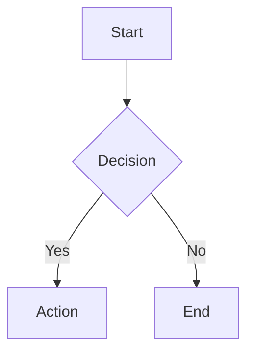

# NoteCraft

A privacy-first, Obsidian-flavored markdown note-taking app built with Next.js 16, CodeMirror 6, and an industrial-grade markdown-it rendering pipeline. All notes live in your browser's localStorage — no server, no tracking, no sign-up.

**Live Demo**: [notecraft-6hl.pages.dev](https://notecraft-6hl.pages.dev)

---

## Features

- **Obsidian-flavored Markdown** — Callouts, embeds, tags, block references, comments, footnotes, math, mermaid diagrams, and more
- **Live Preview** — Split-pane editing with real-time rendered output (150ms debounced) and bidirectional scroll sync
- **Mobile-Ready** — Robust editor with proper keyboard/cursor handling on mobile view mode switches; sidebar auto-closes on note selection
- **Hybrid Rendering** — Obsidian-style Live Preview decorations in the editor (checkboxes, embeds, images, math, links)
- **Obsidian Embeds** — Note transclusions (`![[note]]`) with live resolution and content injection, image embed+resize (`![[img.png|300]]`), heading/block embeds (`![[note#^id]]`); click to navigate or auto-create missing notes
- **Obsidian Tags** — Inline tags (`#tag`, `#nested/tag`) rendered as clickable badges; click to search notes by tag
- **Block References** — Define blocks with `^block-id` and reference them from embeds
- **Front Matter Properties** — YAML front matter rendered as a collapsible properties panel
- **Code-block Admonitions** — `~~~ad-note` syntax as an alternative to blockquote callouts
- **Callout Picker** — Toolbar dropdown with all 14 callout types, so you never have to memorize syntax
- **Syntax Highlighting** — 40+ languages via Shiki (github-light / github-dark themes)
- **Image Upload** — Drag-and-drop, paste, or click to upload (stored as data URLs in localStorage)
- **Command Palette** — Ctrl+K for quick navigation and actions
- **Slash Commands** — Type `/` for a Notion-style insert menu
- **Document Formatting** — Prettier-powered markdown formatting (Ctrl+Shift+F)
- **Dark Mode** — Full light/dark theme support with persistence across sessions
- **Heading Navigation** — Click any heading in preview to jump straight to it in the editor
- **Error Recovery** — React Error Boundary catches rendering crashes with a retry UI
- **Inline AI Suggestions** — Ghost text with Tab-to-accept, wired and ready for any AI backend
- **Heading Slug Panel** — Set heading IDs via an inline panel instead of browser `prompt()`
- **XSS-Safe** — All output sanitized through DOMPurify with a carefully curated allowlist (no iframe)
- **Rendering Indicator** — Visual spinner when the preview is re-rendering
- **Zero Backend** — Everything runs client-side, persisted to localStorage via Zustand

---

## Architecture Overview

```
┌─────────────────────────────────────────────────────────────────┐
│                        NoteCraft App                            │
│                                                                 │
│  ┌──────────┐   ┌──────────────────┐   ┌─────────────────────┐ │
│  │  Sidebar  │   │   CodeMirror 6   │   │  Markdown Preview   │ │
│  │          │   │                  │   │                     │ │
│  │ • Notes  │   │ ┌──────────────┐ │   │  markdown-it        │ │
│  │ • Search │   │ │  Toolbar     │ │   │  + 23 plugins       │ │
│  │ • CRUD   │   │ │ (React Portal)│ │   │  + DOMPurify        │ │
│  │          │   │ ├──────────────┤ │   │  + Shiki             │ │
│  │          │   │ │  Editor      │ │   │  + Medium-zoom       │ │
│  │          │   │ │  + Hybrid    │ │   │  + Mermaid (lazy)    │ │
│  │          │   │ │    Render    │ │   │                     │ │
│  └──────────┘   │ │  + AI Ghost │ │   └─────────────────────┘ │
│                  │ │  + Slug     │ │          ▲                │
│                  │ └──────────────┘ │          │ scroll sync   │
│                  └──────────────────┘          │ (split view)  │
│                            │                    │               │
│                    Zustand Store                │               │
│                    (localStorage)               │               │
└─────────────────────────────────────────────────────────────────┘
```

### Rendering Pipeline

```
Markdown text
     │
     ▼
┌──────────────────────────────┐
│  markdown-it + 23 plugins    │  Step 1: Parse + Render
│  (see Rendering Pipeline     │
│   section below)             │
└──────────────┬───────────────┘
               │
               ▼
┌──────────────────────────────┐
│  DOMPurify Sanitization      │  Step 2: XSS-safe output
│  (120+ allowed tags,         │
│   70+ allowed attrs)         │
└──────────────┬───────────────┘
               │
               ▼
┌──────────────────────────────┐
│  Shiki Syntax Highlighting   │  Step 3: Async post-processing
│  (40 languages,              │
│   github-light/dark)         │
└──────────────┬───────────────┘
               │
               ▼
┌──────────────────────────────┐
│  Post-Render                 │  Step 4: Client-side enhancements
│  • Medium-zoom (images)      │
│  • Mermaid (diagrams)        │
│  • Embed resolution          │
│  • Event delegation          │
│  • Front matter display      │
└──────────────────────────────┘
```

---

## Rendering Pipeline — 23 Plugins

NoteCraft uses **markdown-it** as its rendering engine with a plugin pipeline that combines the best of the markdown-it ecosystem with algorithms backported from the Remark/Astro ecosystem. The principle: *markdown-it is the engine, Remark is the reference implementation* — we study how Remark plugins handle edge cases, then implement the same logic in markdown-it's token stream model.

### NPM Plugins

| # | Plugin | Version | Syntax | Description |
|---|--------|---------|--------|-------------|
| 1 | [`markdown-it-front-matter`](https://github.com/parksb/markdown-it-front-matter) | ^0.2.4 | `---\ntitle: ...\n---` | YAML front matter extraction |
| 2 | [`markdown-it-task-lists`](https://github.com/revin/markdown-it-task-lists) | ^2.1.1 | `- [ ] task` | GFM task lists with checkboxes |
| 3 | [`markdown-it-footnote`](https://github.com/markdown-it/markdown-it-footnote) | ^4.0.0 | `[^1]` | Footnotes with references |
| 4 | [`markdown-it-sub`](https://github.com/markdown-it/markdown-it-sub) | ^2.0.0 | `H~2~O` | Subscript text |
| 5 | [`markdown-it-sup`](https://github.com/markdown-it/markdown-it-sup) | ^2.0.0 | `E=mc^2^` | Superscript text |
| 6 | [`markdown-it-mark`](https://github.com/markdown-it/markdown-it-mark) | ^4.0.0 | `==highlight==` | Highlighted text |
| 7 | [`markdown-it-attrs`](https://github.com/arve0/markdown-it-attrs) | ^5.0.0 | `{.class #id}` | Custom attributes on elements |
| 8 | [`markdown-it-emoji`](https://github.com/markdown-it/markdown-it-emoji) | ^3.0.0 | `:rocket:` → 🚀 | Emoji shortcuts (full Unicode set) |
| 9 | [`markdown-it-deflist`](https://github.com/markdown-it/markdown-it-deflist) | ^3.0.1 | `Term\n: Definition` | Definition lists |
| 10 | [`@traptitech/markdown-it-katex`](https://github.com/traptitech/markdown-it-katex) | ^3.6.0 | `$...$` / `$$...$$` | KaTeX math rendering |

### Custom Plugins (built in-house)

All Obsidian-specific transforms (comments, embeds, tags, callouts, block references) are consolidated into a single [`obsidian-transforms.ts`](src/lib/renderer/obsidian-transforms.ts) core rule that performs one inline walk and block-level transforms in a single pass for maximum performance.

| # | Plugin | File | Syntax | Description |
|---|--------|------|--------|-------------|
| 11 | **Obsidian Transforms** | [`obsidian-transforms.ts`](src/lib/renderer/obsidian-transforms.ts) | `%%comment%%`, `![[note]]`, `#tag`, `> [!note]`, `^block-id` | Merged core rule: comment stripping → embed resolution → tag rendering (inline sub-passes), then callout + block-ref transforms (block level) |
| 12 | **Mermaid Plugin** | [`mermaid-plugin.ts`](src/lib/renderer/mermaid-plugin.ts) | ` ```mermaid ` | Lazy-load placeholder pattern for client-side rendering |
| 13 | **Heading ID Plugin** | [`heading-id-plugin.ts`](src/lib/renderer/heading-id-plugin.ts) | `## Heading {#custom-id}` | GitHub-slugger compatible heading anchors with deduplication |
| 14 | **Admonition Plugin** | [`admonition-plugin.ts`](src/lib/renderer/admonition-plugin.ts) | `~~~ad-note` | Code-block admonitions with 14 canonical types |
| 15 | **Front Matter Display** | [`frontmatter-display.ts`](src/lib/renderer/frontmatter-display.ts) | YAML → `<details>` panel | Collapsible properties panel with type-aware styling |

### Post-Processing Pipeline (not markdown-it plugins)

| # | Component | Package | Description |
|---|-----------|---------|-------------|
| 16 | **Syntax Highlighting** | [`shiki`](https://github.com/shikijs/shiki) ^4.2.0 | Async code highlighting, 40 languages, github-light/dark themes |
| 17 | **XSS Sanitization** | [`dompurify`](https://github.com/cure53/DOMPurify) ^3.4.9 | 120+ allowed tags, 70+ allowed attrs, custom data-attributes, no iframe |
| 18 | **Image Zoom** | [`medium-zoom`](https://github.com/francoischalifour/medium-zoom) ^1.1.0 | Click-to-zoom on preview images |
| 19 | **Embed Resolution** | — | Client-side: finds matching notes and injects rendered content into embed placeholders |
| 20 | **Mermaid Rendering** | [`mermaid`](https://github.com/mermaid-js/mermaid) ^11.15.0 | Lazy-loaded diagram rendering with strict security level |
| 21 | **Event Delegation** | — | Interactive click handlers: tag → search, embed → navigate/create, task toggle, heading jump to editor |
| 22 | **Code Copy Button** | — | Click-to-copy on all code blocks with toast feedback |
| 23 | **Rendering Indicator** | — | Visual spinner overlay during async render cycles |

---

## Custom Plugins — Deep Dive

### Obsidian Transforms (Merged Core Rule)

The heart of Obsidian compatibility. A single core rule `obsidian_transforms` runs after the `inline` parse phase and performs all Obsidian-specific transforms in one pass:

**Inline sub-passes** (one walk through all text tokens):
1. **Comment stripping** — `%%hidden%%` content is removed from output
2. **Embed rendering** — `![[note]]`, `![[image.png|300]]`, `![[note#^blockid]]` patterns are replaced with styled embed containers with data attributes for client-side resolution
3. **Tag rendering** — `#tag`, `#nested/tag` patterns are rendered as clickable `<a>` badges with context-aware parsing (no false positives on headings or code)

**Block-level transforms:**
4. **Callout rendering** — `> [!note] Title` blockquotes are transformed into styled callout divs, with foldable support via `<details>/<summary>`, 14 canonical types with 18 aliases
5. **Block reference handling** — `^block-id` definitions are attached to their parent blocks as `data-block-id` attributes

**What was backported from the Remark ecosystem:**
- **From [`@r4ai/remark-callout`](https://github.com/r4ai/remark-callout):** The `parseCallout` regex, foldable `<details>/<summary>` rendering, auto-capitalize type-as-title
- **From [`flowershow/remark-callouts`](https://github.com/flowershow/remark-callouts):** Type alias mapping system
- **From [`remark-obsidian-callout`](https://github.com/MoritzRS/remark-obsidian-callout):** Data attributes for CSS targeting
- **From [`remark-obsidian-md`](https://github.com/MoritzRS/remark-obsidian-md):** Foldable chevron indicators, embed rendering pattern, frontmatter display
- **From [`@moritzrs/remark-ofm`](https://github.com/MoritzRS/remark-ofm):** Context-aware tag detection algorithm
- **From [`@heavycircle/remark-obsidian`](https://github.com/heavycircle/remark-obsidian):** Block reference syntax and embed handling
- **From [`markdown-it-hashtag`](https://github.com/svbergerhem/markdown-it-hashtag):** Text node scanning approach for tags

---

### Mermaid Plugin

Detects `mermaid` fenced code blocks and emits a placeholder container for client-side lazy rendering.

**Syntax:**

````markdown

````

**Security:** Mermaid is initialized with `securityLevel: 'strict'` to prevent arbitrary HTML/JS injection in diagrams. IDs use deterministic counters instead of `Math.random()`.

**Architecture:** Intercepts the `fence` renderer for `mermaid` language blocks, emits `<div class="mermaid-container" data-mermaid-source="...">` with an SVG loading placeholder. The React preview component lazily imports the `mermaid` package and renders SVG diagrams into these containers.

---

### Heading ID Plugin

Auto-generates GitHub-style slug IDs for all headings, with deduplication support.

**Syntax:**

```markdown
## Introduction {#custom-id}
## Another Heading    <!-- auto-generates id="another-heading" -->
```

**Architecture:** Overrides the `heading_open` renderer, generates a slug from inline content using a custom algorithm (strip HTML → remove non-word → lowercase → spaces to hyphens → collapse hyphens), deduplicates via an `env.__headingSlugs` Map that appends `-1`, `-2`, etc. Custom IDs via `{#id}` attribute syntax are preserved with priority. Uses [`github-slugger`](https://github.com/Flet/github-slugger) internally.

---

### Admonition Plugin

Provides code-block style admonitions as an alternative to the blockquote callout syntax.

**Syntax:**

````markdown
~~~ad-note
Title: Important Note
Content here with **markdown** support
~~~
````

**14 Recognized Types (shared with callout plugin):**

| Type | Icon | Aliases |
|------|------|---------|
| `note` | ✎ | — |
| `info` | ℹ | — |
| `tip` | ☝ | `hint` |
| `success` | ✔ | `check`, `done` |
| `question` | ❓ | `help`, `faq` |
| `warning` | ⚠ | `caution`, `attention` |
| `failure` | ✘ | `fail`, `missing` |
| `danger` | ⛔ | `error` |
| `bug` | 🐛 | — |
| `example` | 📋 | — |
| `quote` | ❝ | `cite` |
| `abstract` | 📑 | `summary`, `tldr` |
| `todo` | 📝 | — |
| `important` | 🔥 | — |

---

### Front Matter Display

Renders YAML front matter as a collapsible properties panel at the top of the document, mirroring Obsidian's reading mode properties view.

**Rendered output:** A `<details open>` panel containing a table of key-value pairs, with type-aware styling for each value type:

| Value Type | CSS Class | Example |
|-----------|-----------|---------|
| String | `.frontmatter-string` | `My Note` |
| Number | `.frontmatter-number` | `3` |
| Boolean | `.frontmatter-boolean` | `true` |
| Date | `.frontmatter-date` | `2025-01-15` |
| Array | `.frontmatter-array` → `.frontmatter-tag` | `[productivity, ideas]` |
| Null | `.frontmatter-null` | `null` |
| Empty array | `.frontmatter-empty` | `[]` |

---

## CodeMirror 6 Extensions

NoteCraft builds a rich set of CodeMirror 6 extensions, some based on existing open-source projects with improvements, and some entirely original.

### Based on Existing Projects

| Extension | Based On | Changes |
|-----------|----------|---------|
| **Markdown Commands** | [`yeliex/codemirror-markdown-commands`](https://github.com/yeliex/codemirror-markdown-commands) | Added toggle support (wrap/unwrap), smart cursor placement, heading cycling, document formatting |
| **Toolbar** | [`yeliex/codemirror-toolbar`](https://github.com/yeliex/codemirror-toolbar) | Replaced static DOM with React portal, Lucide icons, shadcn/ui dropdown menus, callout picker |
| **Image Upload** | [`yeliex/codemirror-markdown-image`](https://github.com/yeliex/codemirror-markdown-image) | Enhanced with progress tracking, drag-and-drop, paste-to-upload, linter for upload status |
| **Inline Suggestion** | [`rizerphe/codemirror-companion-extension`](https://github.com/rizerphe/codemirror-companion-extension) | Stabilized API, instance-level debounce, Tab accept, Escape dismiss — wired with no-op fetchFn, ready for any AI backend |
| **Final Newline** | [`yeliex/codemirror-final-newline`](https://github.com/yeliex/codemirror-final-newline) | Configurable with focus-only mode |

### Original Extensions

| Extension | Description |
|-----------|-------------|
| **Slash Commands** | Notion-style `/` menu built on [`@codemirror/autocomplete`](https://github.com/codemirror/autocomplete) — type `/` to insert any block element, heading, list, or callout |
| **Hybrid Render** | See the full [Hybrid Render System](#hybrid-render-system--architecture--upgrade-guide) section below — 21-plugin Obsidian-style Live Preview using CM6 Decoration API |
| **Heading Slug Utilities** | Copy/set/remove heading IDs, jump-to-heading by slug, document heading scanner |
| **Slug Input Panel** | CM6 panel-based heading ID input UI (replaces browser `prompt()`) with Enter/Escape keyboard support |
| **Lezer Grammar Extensions** | Custom syntax highlighting for Obsidian-flavored markdown: callouts, comments, embeds, tags, block references, front matter |
| **Editor Theme** | BaseTheme for toolbar container, autocomplete dropdowns, and hybrid render decorations |

---

## Hybrid Render System — Architecture & Upgrade Guide

This is the most feature-complete CM6 decoration-based hybrid renderer in the ecosystem. It provides Obsidian-style Live Preview by layering `Decoration.mark()` and `Decoration.widget()` on top of the raw Markdown source — hiding syntax when the cursor is away, revealing it when the cursor approaches. It does **not** use ProseMirror, contenteditable, or a dual-engine approach.

All source files live in [`src/lib/codemirror-ext/hybrid-render/`](src/lib/codemirror-ext/hybrid-render/).

### What This Is in the Ecosystem

There are four known architectural tiers for Markdown WYSIWYG in CodeMirror. Understanding these is critical for evaluating upgrade opportunities — a solution from a different tier can provide ideas but is never a direct drop-in replacement.

| Tier | Approach | Cursor Model | Examples | NoteCraft Uses This? |
|------|----------|-------------|----------|---------------------|
| **1. Decoration-Based** | CM6 `Decoration` API on top of raw text | Native CM6 cursor, decorations hide/show syntax | Atomic Editor, codemirror-live-markdown, codemirror-markdown-hybrid, codemirror-rich-markdoc | **Yes** |
| **2. Obsidian-Flavored CM6** | Tier 1 + Obsidian-specific extensions | Same as Tier 1 | @type32/codemirror-rich-obsidian, codemirror-for-writers | Partial (inspiration only) |
| **3. ProseMirror/Dual-Engine** | ProseMirror document model under CM6 | ProseMirror schema, node types | Milkdown, Gravity UI, MDXEditor | No |
| **4. Contenteditable** | Raw contenteditable div with custom parser | Browser native, fragile | Vditor, Cherry Markdown, Muya/Mark Text | No |

**Key implication:** If you find a new repo that uses ProseMirror `Schema`, `NodeType`, or `contenteditable`, it is a different tier. Extract ideas from it, but do not attempt to integrate its code — the architectural gap is too wide.

### System Architecture

```
                         ┌──────────────────────────────────────────────────┐
                         │               Editor State                       │
                         │                                                  │
                         │  ┌─────────────────┐  ┌───────────────────────┐  │
                         │  │ cursorPosition   │  │ editorFocusField      │  │
                         │  │ Field            │  │ (via focusChange-     │  │
                         │  │ (pre-computed    │  │  Effect)              │  │
                         │  │  cursor info)    │  └──────────┬────────────┘  │
                         │  └────────┬────────┘             │               │
                         │           │                      │               │
                         │  ┌────────▼──────────────────────▼────────────┐  │
                         │  │      shouldShowSource()                    │  │
                         │  │      shouldShowSourceForLine()             │  │
                         │  │      (THE single decision function)        │  │
                         │  └────────┬───────────────────────────────────┘  │
                         │           │                                       │
                         │           │  Called by EVERY feature plugin      │
                         │           │                                       │
                         │  ┌────────▼───────────────────────────────────┐  │
                         │  │          Feature Plugins                    │  │
                         │  │                                            │  │
                         │  │  ViewPlugins (inline):                     │  │
                         │  │   heading-marks  emphasis-marks             │  │
                         │  │   embed-images   links                     │  │
                         │  │   checkboxes     inline-code               │  │
                         │  │   tags           callouts                  │  │
                         │  │   code-blocks    blockquote-marks          │  │
                         │  │   comments       block-refs                │  │
                         │  │   embed-transclusions  admonitions         │  │
                         │  │   tables          footnotes                │  │
                         │  │   inline-math                              │  │
                         │  │                                            │  │
                         │  │  StateFields (block-level):                │  │
                         │  │   hr              display-math             │  │
                         │  │   frontmatter                               │  │
                         │  └────────┬───────────────────────────────────┘  │
                         │           │                                       │
                         │           │  Decorations + Atomic Ranges          │
                         │           │                                       │
                         │  ┌────────▼───────────────────────────────────┐  │
                         │  │       Editor View (rendered output)         │  │
                         │  └────────────────────────────────────────────┘  │
                         │                                                  │
                         │  ┌────────────────────────────────────────────┐  │
                         │  │  Cross-cutting Concerns                     │  │
                         │  │                                             │  │
                         │  │  drag-state.ts    → Drag suppression        │  │
                         │  │  shared.ts        → Regex, decorations,     │  │
                         │  │                      skip ranges            │  │
                         │  │  atomic-ranges.ts → Fallback atomic ranges  │  │
                         │  │  theme.ts         → ~90 CSS rules           │  │
                         │  │  index.ts         → Orchestrator + flags    │  │
                         │  └────────────────────────────────────────────┘  │
                         └──────────────────────────────────────────────────┘
```

### File Map — What Each File Does and When to Touch It

#### Cross-Cutting Modules (touched when changing system-wide behavior)

| File | CM6 Type | Purpose | Touch when... |
|------|----------|---------|---------------|
| `cursor-awareness.ts` | StateField + Facet + ViewPlugin | Central cursor/focus/drag decision engine. Pre-computes active lines and ranges. Exports `shouldShowSource()`, `shouldShowSourceForLine()`, `livePreviewEnabled` Facet, `editorFocusField`, `focusMonitorPlugin` | Adding new cursor-awareness logic (e.g., multi-cursor heuristics, proximity-based reveal), changing the global "show source vs rendered" decision, adding a new global toggle |
| `shared.ts` | Utility module | Regex patterns (`EMBED_IMAGE_RE`, `TAG_RE`, `INLINE_MATH_RE`, etc.), singleton `Decoration.mark()` instances (`hiddenMark`, `activeMark`, `fadedMark`, etc.), `collectSkipRanges()`, `isInRangeList()`, `HybridRenderOptions` feature-flag type | Adding a new regex pattern, adding a new reusable decoration mark, changing feature flags |
| `drag-state.ts` | StateField + DOM handlers | Tracks mouse-dragging state via `startDragSelect`/`endDragSelect` StateEffects. Exports `checkUpdateAction()` which returns `'rebuild'`/`'skip'`/`'none'` — the tri-state that ALL ViewPlugins call in their `update()` | Changing drag behavior, adding touch support, modifying the rebuild/skip/none decision logic |
| `atomic-ranges.ts` | `EditorView.atomicRanges` provider | Fallback atomic ranges for embed images and tags. Most plugins now self-provide atomic ranges via the `provide` key — this is a safety net for any that don't | Adding new decoration types that need atomic ranges but don't self-provide (prefer self-providing instead) |
| `theme.ts` | `EditorView.baseTheme` | ~90 CSS rules with `cm-hybrid-*` naming convention. Includes CSS transitions for smooth hide/show and `&dark` selectors for dark mode | Adding visual styling for any new decoration class, changing colors/spacing/transitions, adding dark mode overrides |
| `index.ts` | Orchestrator function | `hybridRender(opts?)` factory returns `Extension[]` based on feature flags. Imports and wires all 21 plugins. Re-exports key APIs for external consumption | Adding a new plugin to the system, changing feature-flag wiring, changing the order of extensions |

#### Feature Plugins — ViewPlugin-based (inline decorations, can access `view`)

| File | Syntax Handled | Key Patterns | Self-Provides Atomic Ranges? | Touch when... |
|------|---------------|--------------|------------------------------|---------------|
| `heading-marks.ts` | `# H1-H6` | Tree scan (`HeaderMark`, `ATXHeading*`), `shouldShowSourceForLine()`, heading size CSS classes | No | Changing heading mark hiding behavior, adding new heading level styles |
| `emphasis-marks.ts` | `**bold**`, `*italic*`, `~~strike~~` | Two-pass tree scan (collect parents, then mark nodes), `supplementMidTypingEmphasis()` regex fallback for mid-typing flicker prevention | No | Changing emphasis detection, adding new emphasis types (underline, highlight), fixing mid-typing flicker |
| `embed-images.ts` | `![[img.png\|300]]` | Dual scan (Lezer `Image` then regex `EMBED_IMAGE_RE`), image thumbnail `WidgetType` with `Image` node | Yes (via `provide`) | Adding new embed types, changing image thumbnail rendering, adding resize handles |
| `links.ts` | `[label](url)`, `` | Tree scan (`Link`, `Image` nodes), `ImageThumbnailWidget` with dimension cache (Atomic Editor pattern) | Yes (via `provide`, filter to Image replace decorations only) | Changing link styling, adding link preview on hover, changing image thumbnail behavior |
| `checkboxes.ts` | `- [x]`, `- [ ]` | Tree scan (`Task`/`TaskMarker` nodes), interactive checkbox `WidgetType` with click-to-toggle dispatching `toggleCheckbox` StateEffect | No | Changing checkbox rendering, adding subtask support, changing toggle behavior |
| `inline-code.ts` | `` `code` `` | Tree scan (`InlineCode` node), background styling, backtick hiding | No | Changing inline code rendering, adding syntax highlighting inside inline code |
| `tags.ts` | `#tag`, `#nested/tag` | Dual scan (Lezer then regex `TAG_RE`), `collectSkipRanges()` for code-block exclusion | No | Changing tag rendering, adding tag autocomplete integration, fixing false positives |
| `callouts.ts` | `> [!note] Title` | Regex scan (`CALLOUT_HEADER_RE`), line decorations per callout line, marker badges | No | Adding new callout types, changing callout rendering, adding foldable callouts |
| `code-blocks.ts` | `` ```lang `` | Tree scan (`FencedCode` node), fence hiding, language badge `WidgetType` (singleton per language) | No | Changing code block rendering, adding fold/collapse, changing language badge |
| `blockquote-marks.ts` | `> quote` | Tree scan (`QuoteMark` node), fade styling | No | Changing blockquote rendering, adding nested blockquote support |
| `comments.ts` | `%%hidden%%` | Dual scan (Lezer then regex `COMMENT_RE`), hide content + singleton indicator widget | No | Changing comment rendering, adding comment toggle |
| `block-refs.ts` | `^block-id` | Regex scan (`BLOCK_REF_RE`), clickable badge styling | No | Changing block reference rendering, adding block reference navigation |
| `embed-transclusions.ts` | `![[note]]`, `![[note#heading]]`, `![[note#^id]]` | Regex scan (`EMBED_TRANSCLUDE_RE`), transclusion widget with header/content/name sections | No | Adding transclusion content resolution, changing embed widget appearance |
| `admonitions.ts` | `~~~ad-note` | Regex scan (`ADMONITION_FENCE_RE`), reuses callout CSS classes | No | Adding new admonition types, changing admonition rendering |
| `tables.ts` | `\| header \|` | Dual scan (Lezer `Table` node then regex), column alignment detection from separator line, `changeAffectsTables()` skip guard, self-providing atomic ranges, `TableBadgeWidget` with structure-only `eq()` and badge cache | Yes (via `provide`) | Upgrading table cell editing, adding column resize, changing alignment detection, adding sort |
| `footnotes.ts` | `[^1]`, `^[inline]`, `[^1]: def` | Dual scan (Lezer `Footnote`/`FootnoteRef` then regex), definition line decorations | Yes (via `provide`) | Adding footnote preview on hover, changing footnote reference rendering |
| `math.ts` (inline) | `$...$` | Regex scan (`INLINE_MATH_RE`), hide `$` delimiters + math styling. Lazy-loads KaTeX | No | Changing math rendering, adding MathML output, fixing Safari regex issues |

#### Feature Plugins — StateField-based (block-level layout-changing decorations)

StateFields are used when the decoration changes line layout (block replace). They **cannot** access `view` directly, so they use `editorFocusField` (updated via `focusChangeEffect`) and their own `checkFieldAction()` function instead of `checkUpdateAction()`.

| File | Syntax Handled | Key Patterns | Touch when... |
|------|---------------|--------------|---------------|
| `hr.ts` | `---`, `***`, `___` | Tree scan (`HorizontalRule` node), singleton `HorizontalRuleWidget` (all HRs look identical → one DOM element reused), `shouldShowSourceForLine()` | Changing HR rendering, adding themed HR styles |
| `math.ts` (display) | `$$...$$` | Regex scan (`DISPLAY_MATH_RE`), `MathPreviewWidget` with KaTeX rendering, `checkFieldAction()` for StateField drag-awareness | Changing display math rendering, adding equation numbering |
| `frontmatter.ts` | `---\nyaml\n---` | Tree scan (`Frontmatter` node) + regex fallback, `CollapsedFrontmatterWidget`/`ExpandedFrontmatterWidget` with toggle via `toggleFrontmatter` StateEffect, `frontmatterExpandedField` tracks collapse state, click handler on toggle | Changing frontmatter rendering, adding property type icons, adding inline editing |

### Key Abstractions Every Plugin Uses

These are the 6 concepts you must understand before modifying any plugin:

1. **`shouldShowSource(state, from, to)` → `boolean`** — The single decision function. Returns `true` when the cursor/selection overlaps `[from, to)`, the editor is focused, live preview is enabled, and no drag is in progress. Every plugin calls this to decide "show raw syntax or rendered form?" **Never use `isCursorInRange()` directly** — it does not handle drag suppression, focus, or the live-preview toggle.

2. **`shouldShowSourceForLine(state, lineFrom, lineTo)` → `boolean`** — The line-level variant. Uses pre-computed active line numbers from `cursorPositionField` for better performance on long documents. Use this for line-level plugins (headings, blockquotes, HR) instead of the range variant.

3. **`checkUpdateAction(update)` → `'rebuild' | 'skip' | 'none'`** — Called by every ViewPlugin's `update()` method. Returns `'rebuild'` when decorations need recomputing (doc changed, viewport changed, selection changed, drag ended), `'skip'` during active drag (prevents flicker), `'none'` when nothing relevant changed. StateFields use their own `checkFieldAction(tr)` with equivalent logic.

4. **`collectSkipRanges(state, from, to)` → `Array<{from, to}>`** — Returns ranges inside code blocks and inline code where regex-based plugins should NOT match. Without this, a `#tag` inside a code fence would get a badge decoration. Always call this in regex-scan loops and check with `isInRangeList()`.

5. **Self-providing atomic ranges via `provide` key** — When a ViewPlugin's decorations should make the cursor treat decorated ranges as atomic units (skip over them with arrow keys), the plugin adds a `provide` key on `ViewPlugin.fromClass` that maps its `DecorationSet` to `EditorView.atomicRanges`. This is preferred over adding ranges to the centralized `atomic-ranges.ts` fallback because it keeps plugins self-contained. Example from `tables.ts`:
   ```ts
   provide: (plugin) =>
     EditorView.atomicRanges.of((view) => {
       return view.plugin(plugin)?.decorations || Decoration.none
     }),
   ```

6. **Singleton `Decoration.mark()` instances** — CM6 reuses decoration objects by identity for efficient diffing. Creating new `Decoration.mark()` instances on every rebuild defeats this optimization. Always use the pre-created instances from `shared.ts` (`hiddenMark`, `activeMark`, `fadedMark`, etc.) or create module-level singletons. For `WidgetType`, implement `eq()` with structure-only comparison so CM6 reuses the DOM.

### How to Add a New Plugin (Step-by-Step Recipe)

1. **Create `your-feature.ts`** in `src/lib/codemirror-ext/hybrid-render/`. Choose the plugin type:
   - **ViewPlugin** — for inline decorations (hiding syntax markers, styling text). Can access `view` for DOM measurements. Use `checkUpdateAction(update)` in `update()`.
   - **StateField** — for block-level layout-changing decorations (replacing entire blocks with widgets). Cannot access `view` directly; use `editorFocusField` and `checkFieldAction(tr)`.

2. **Import cursor-awareness:**
   ```ts
   import { shouldShowSource, shouldShowSourceForLine } from './cursor-awareness'
   import { checkUpdateAction } from './drag-state'  // ViewPlugin only
   ```

3. **Choose your scanning strategy:**
   - **Tree-first** (preferred): Use `syntaxTree(state).iterate()` to find Lezer nodes. More accurate, handles nesting correctly. Start here.
   - **Regex fallback** (for nodes Lezer doesn't parse): Use `collectSkipRanges()` + `isInRangeList()` to avoid false positives in code blocks. Add your regex to `shared.ts`.
   - **Dual scan** (best of both): Try tree scan first. If no tree nodes found, fall back to regex. This is the pattern used by `tables.ts`, `footnotes.ts`, `tags.ts`.

4. **Use singleton decorations from `shared.ts`** or define new ones:
   ```ts
   import { hiddenMark, activeMark } from './shared'
   // OR define new ones at module level:
   const myMark = Decoration.mark({ class: 'cm-hybrid-my-feature' })
   ```

5. **Add self-providing atomic ranges** if your decoration should be cursor-atomic:
   ```ts
   export const myPlugin = ViewPlugin.fromClass(class { ... }, {
     decorations: (v) => v.decorations,
     provide: (plugin) =>
       EditorView.atomicRanges.of((view) => {
         return view.plugin(plugin)?.decorations || Decoration.none
       }),
   })
   ```

6. **Add CSS to `theme.ts`** with `cm-hybrid-*` naming + `&dark` override:
   ```ts
   '.cm-hybrid-my-feature': { color: '#7c5cfc', ... },
   '&dark .cm-hybrid-my-feature': { color: '#a78bfa', ... },
   ```

7. **Add feature flag** to `HybridRenderOptions` interface in `shared.ts`:
   ```ts
   /** My feature description. Default: true */
   myFeature?: boolean
   ```

8. **Wire into `hybridRender()`** in `index.ts`:
   ```ts
   import { myPlugin } from './your-feature'
   // In the features object:
   myFeature: opts.myFeature ?? true,
   // In the extensions array:
   if (features.myFeature) extensions.push(myPlugin)
   ```

9. **Add barrel export** in `index.ts` if external code needs your plugin's types/effects.

### Decision Traces — Why Each Key Choice Was Made

Understanding the "why" behind architectural decisions is essential for making good upgrade choices. Changing these without understanding the reasoning will likely reintroduce solved problems.

#### Why `shouldShowSource()` instead of per-plugin cursor checks?

**Problem:** Originally, each plugin independently called `isCursorInRange()` from `shared.ts`. With 17+ plugins, this meant ~34 redundant selection reads per update cycle (17 plugins × 2 calls each for open/close ranges). Worse, some plugins checked cursor on range boundaries while others checked on lines, causing inconsistent behavior — emphasis marks would hide but heading marks would stay visible when the cursor was at the exact same position.

**Solution:** A centralized `shouldShowSource()` function that combines cursor position, drag state (`dragSelectingField`), focus state (`editorFocusField`), and the global Live Preview toggle (`livePreviewEnabled` Facet) into a single boolean answer. All plugins call this one function, ensuring consistent behavior. The pre-computed `cursorPositionField` computes active lines and ranges once per update, reducing the 34 selection reads to 1.

**Do not change this unless:** You have a fundamentally different cursor-awareness model (e.g., proximity-based reveal where decorations within N characters of the cursor partially fade instead of fully showing).

#### Why self-providing atomic ranges instead of centralized `atomic-ranges.ts`?

**Problem:** Most CM6 hybrid renderers use a single `EditorView.atomicRanges` extension that scans all decoration types. This creates tight coupling — every new plugin must register its ranges in the central module, and changes to one plugin's decorations can affect the atomic range computation of another.

**Solution:** Each ViewPlugin provides its own atomic ranges via the `provide` key on `ViewPlugin.fromClass`. The plugin's own `DecorationSet` is mapped directly to atomic ranges. This means plugins are self-contained and can be added/removed independently without touching a central registry. The `atomic-ranges.ts` fallback exists only for the few decoration types that don't self-provide (currently embed images and tags that are caught by regex but not by a ViewPlugin).

**Do not change this unless:** CM6 introduces a new API for atomic ranges that makes the `provide` pattern obsolete.

#### Why dual scanning (Lezer tree-first, regex fallback)?

**Problem:** The Lezer parser for Markdown (`@codemirror/lang-markdown`) recognizes standard Markdown nodes like `Emphasis`, `StrongEmphasis`, `Link`, `Image`, `FencedCode`, etc. But it does NOT recognize Obsidian-specific syntax like `![[embed]]`, `#tag`, `%%comment%%`, `^block-id`, or `~~~ad-note`. Plugins for these syntaxes must use regex. However, regex-only scanning has false positives — a `#tag` inside a code block, or an `![[embed]]` inside inline code.

**Solution:** Plugins first try tree-based scanning. If the tree has the relevant nodes (e.g., `Table`, `Footnote`), they use those. If the tree doesn't have the nodes (either because Lezer doesn't parse them, or because the syntax is invalid), they fall back to regex scanning with `collectSkipRanges()` to exclude code blocks. This gives the accuracy of tree-based parsing where available and the coverage of regex where not.

**Do not change this unless:** A new version of `@codemirror/lang-markdown` or a custom Lezer grammar adds nodes for Obsidian syntax, making regex fallback unnecessary for those features.

#### Why drag suppression as a tri-state?

**Problem:** When the user mouse-drags to select text, each `selectionSet` event triggers a decoration rebuild. Since `shouldShowSource()` returns `true` when the cursor is in range, the rebuild hides the rendered form and shows raw syntax — causing visible flickering during drag. The cursor briefly enters a decorated range, the syntax flashes, the cursor moves, the syntax hides again.

**Solution:** `dragSelectingField` tracks whether a drag is in progress. During drag, `shouldShowSource()` returns `false` (show rendered form), and `checkUpdateAction()` returns `'skip'` (don't rebuild decorations at all). When the drag ends, `checkUpdateAction()` returns `'rebuild'` to catch up. The tri-state is:
- `'rebuild'` — Doc/viewport changed, or drag just ended, or selection changed (not from drag)
- `'skip'` — Currently dragging, suppress rebuild to prevent flicker
- `'none'` — Nothing relevant changed, keep existing decorations

**Do not change this unless:** You're implementing a different selection model (e.g., column selection, remote cursors) that needs different suppression logic.

#### Why singleton widgets and `eq()` methods?

**Problem:** CM6's decoration diffing compares decorations by identity and `eq()`. If a `WidgetType` is created fresh on every rebuild, `eq()` returns `false` by default (referential inequality), and CM6 destroys and recreates the DOM — causing flicker, losing focus, and breaking iOS scroll momentum.

**Solution:** For stateless widgets where all instances with the same parameters look identical (HR, language badges, table badges), we use singleton instances or small caches. The `eq()` method is implemented with structure-only comparison. Example: `HorizontalRuleWidget.eq()` always returns `true` because all HRs look the same. `TableBadgeWidget.eq()` compares `cols` and `rows` only.

**Do not change this unless:** You're adding stateful widgets that genuinely need DOM recreation on each rebuild.

#### Why `focusChangeEffect` as a StateEffect instead of reading `view.hasFocus`?

**Problem:** StateFields (like `displayMathField`, `hrField`, `frontmatterField`) cannot access the `EditorView` — they only receive `EditorState` and `Transaction`. But they need to know if the editor is focused to decide whether to show source (focused) or rendered form (blurred). `state.field(editorFocusField)` works, but someone has to update that field.

**Solution:** `focusMonitorPlugin` (a ViewPlugin, which CAN access `view`) watches `view.hasFocus` and dispatches `focusChangeEffect.of(currentFocus)` on change. The `editorFocusField` StateField reads this effect in its `update()` method. The `setTimeout(0)` wrapper prevents dispatching during an ongoing update cycle.

**Do not change this unless:** CM6 adds a way for StateFields to access view state directly.

### Dependency Graph — Blast Radius of Changes

This shows which files depend on which. The arrow means "is imported by" or "is read by." If you change a file on the left side of an arrow, everything on the right side may be affected.

```
cursor-awareness.ts ◀── ALL 18 feature plugins call shouldShowSource() or shouldShowSourceForLine()
                    ◀── atomic-ranges.ts calls shouldShowSource()
                    ◀── index.ts re-exports livePreviewEnabled, focusChangeEffect, etc.

shared.ts ◀── ALL feature plugins import regex patterns and/or singleton decorations
           ◀── atomic-ranges.ts imports EMBED_IMAGE_RE, TAG_RE

drag-state.ts ◀── cursor-awareness.ts reads dragSelectingField
              ◀── ALL ViewPlugins call checkUpdateAction()
              ◀── math.ts (display), hr.ts, frontmatter.ts call checkFieldAction() which reads dragSelectingField

theme.ts ◀── ALL feature plugins' CSS classes are defined here (indirect — runtime CSS)

index.ts ◀── External consumers import hybridRender() from here

atomic-ranges.ts ◀── index.ts includes it conditionally
                 ◀── No feature plugins import it (they self-provide)
```

**Most dangerous file to change:** `cursor-awareness.ts` — every single plugin depends on it. A bug here affects all 18 features simultaneously. The safest changes are additive (new helper functions, new exported APIs). Changing `shouldShowSource()` return semantics requires updating all 18 call sites.

**Safest files to change:** Individual feature plugins — they are self-contained and only affect one syntax type. Changing `callouts.ts` cannot break `tables.ts`.

### Evaluation Framework — How to Assess New CM6 Hybrid Render Solutions

When you find a new repository or npm package that provides CM6 Markdown rendering, run it through this checklist:

| # | Criterion | Why It Matters | How to Check |
|---|-----------|---------------|--------------|
| 1 | **Is it decoration-based?** | If it uses ProseMirror or contenteditable, it's a different tier — extract ideas only, not code | Search the source for `Decoration.mark`, `Decoration.widget`, `ViewPlugin`. If you find `Schema`, `NodeType`, `ProseMirror`, `contenteditable` instead, it's Tier 3/4 |
| 2 | **Does it handle cursor-awareness?** | Central to the hybrid render concept — decorations must hide when cursor approaches | Does it check cursor position before applying decorations? Does it use `shouldShowSource()` or equivalent? |
| 3 | **Does it handle atomic ranges?** | Without atomic ranges, the cursor enters the middle of hidden text (e.g., inside `**bold**`) and gets stuck | Search for `EditorView.atomicRanges` or `atomicRanges` in the source |
| 4 | **Does it handle drag suppression?** | Without this, mouse-dragging to select text causes visible flickering | Does it suppress decoration rebuilds during mouse drag? Search for `dragSelect` or pointer event handlers |
| 5 | **How many Markdown features does it cover?** | NoteCraft has 21 plugins covering 25+ syntax types. Most community solutions cover 3-5 | Count the number of distinct syntax types with dedicated decorations |
| 6 | **Is it actively maintained?** | Abandoned packages may use deprecated CM6 APIs | Check last commit date, open issues, npm download trends |
| 7 | **Does it use Lezer tree or regex?** | Tree-based is more accurate; regex is needed for Obsidian syntax not in Lezer grammar | Search for `syntaxTree` (tree) vs raw `RegExp` (regex) usage |
| 8 | **What's its decoration caching strategy?** | Fresh decorations on every rebuild = flicker. Singleton patterns = smooth | Does it reuse `Decoration` instances? Does `WidgetType.eq()` do structure-only comparison? |
| 9 | **Does it handle focus state?** | Blurred editor should show rendered form; StateFields need a way to know focus | Does it propagate focus state to StateFields? Search for `focusChange` or `hasFocus` |
| 10 | **Obsidian compatibility?** | NoteCraft needs Obsidian-specific syntax (embeds, tags, callouts, block refs, comments) | Does it handle any Obsidian syntax? Is there an extension point for it? |

**Scoring guide:**
- **8-10 checks:** Strong candidate for direct pattern adoption or integration
- **5-7 checks:** Good for specific technique extraction (e.g., borrow their table algorithm but not their architecture)
- **Below 5:** Interesting for ideas but architecturally too different; do not attempt integration

### Discovery Strategy — Where to Find New Relevant Repos

#### npm Search Terms

```
codemirror markdown preview
codemirror live preview
codemirror wysiwyg
codemirror decoration markdown
codemirror hybrid render
codemirror rich text markdown
codemirror obsidian
```

#### GitHub Search Terms

```
codemirror decoration markdown
codemirror live preview
codemirror-hide-markdown
codemirror-rich-markdown
codemirror-markdown-hybrid
```

#### Specific Repositories and Packages to Monitor

These are the known Tier 1 (decoration-based) solutions. Check them periodically for new techniques:

| Repository / Package | What It Does | What NoteCraft Already Adopted From It |
|---------------------|-------------|---------------------------------------|
| [`codemirror-live-markdown`](https://github.com/nicktomlin/codemirror-live-markdown) | Reference Obsidian-style Live Preview | `shouldShowSource()` decision function pattern, drag suppression via `checkUpdateAction()`, singleton widget patterns |
| [`codemirror-markdown-hybrid`](https://github.com/danielo515/codemirror-markdown-hybrid) | Hybrid rendering with line-level cursor awareness | `focusChangeEffect` pattern for propagating focus to StateFields, line-level active state pre-computation |
| [`codemirror-rich-markdoc`](https://github.com/markdoc/codemirror-rich-markdoc) | Markdoc-flavored hybrid rendering | Markdoc tag syntax handling (not directly used, but the decoration structure is referenced) |
| [`@type32/codemirror-rich-obsidian`](https://github.com/nicktomlin/codemirror-rich-obsidian) | Obsidian-flavored CM6 extensions | Table rendering reference, Obsidian-specific syntax handling patterns |
| [`codemirror-for-writers`](https://github.com/alizain/codemirror-for-writers) | Writer-focused CM6 extensions | Typing-aware emphasis supplements, word-count aware features |
| [`Atomic Editor`](https://github.com/nicktomlin/atomic-editor) | Full-featured editor with CM6 decorations | WYSIWYG table rendering (column alignment, header styling), `changeAffectsTables()` skip guard, `supplementMidTypingEmphasis()`, image dimension cache, singleton widget patterns |

#### Community Sources

- **Obsidian community plugins** — Obsidian's own editor uses the same CM6 decoration approach internally. Their open-source plugins sometimes reveal new decoration techniques.
- **CodeMirror discussion forum** — [discuss.codemirror.net](https://discuss.codemirror.net) — Search for "live preview", "hybrid render", "decoration"
- **Awesome lists** — Search GitHub for `awesome-codemirror`
- **`@codemirror/view` changelog** — API changes to `Decoration`, `ViewPlugin`, `EditorView.atomicRanges` affect all plugins. Monitor [releases](https://github.com/codemirror/view/releases).

#### Keywords That Indicate Relevance (Same Tier)

These terms in a repository's README or source code suggest it's a Tier 1 decoration-based solution compatible with NoteCraft's approach:

- `Decoration.mark`, `Decoration.widget`, `Decoration.replace`
- `ViewPlugin.fromClass`
- `EditorView.atomicRanges`
- `EditorView.decorations`
- `shouldShowSource`, `isCursorInRange`
- `syntaxTree` (from `@codemirror/language`)

#### Keywords That Indicate WRONG Tier

These terms suggest a fundamentally different architecture. The repo may contain useful ideas but its code cannot be directly integrated:

- `ProseMirror`, `Schema`, `NodeType`, `NodeSpec` → Tier 3 (dual-engine)
- `contenteditable` → Tier 4 (raw contenteditable)
- `EditorState.create({ doc: ... })` with a ProseMirror schema → Tier 3
- `Milkdown`, `MDXEditor`, `Gravity UI` → Tier 3 brands

### Community Pattern Source Map

Which community solutions inspired which patterns in NoteCraft, and where to check for upgrades:

| Pattern in NoteCraft | Original Source | Where to Check for Upgrades |
|---------------------|----------------|----------------------------|
| WYSIWYG table rendering (alignment, header, skip guard) | Atomic Editor's table rendering | `@type32/codemirror-rich-obsidian`, `codemirror-markdown-tables` |
| `shouldShowSource()` centralized decision function | codemirror-live-markdown | `codemirror-live-markdown` npm updates |
| `focusChangeEffect` for StateField focus propagation | codemirror-markdown-hybrid | `codemirror-markdown-hybrid` npm updates |
| Drag suppression tri-state (`checkUpdateAction`) | codemirror-live-markdown | `codemirror-live-markdown` npm updates |
| Mid-typing emphasis supplement (`supplementMidTypingEmphasis`) | Atomic Editor | Atomic Editor source |
| Image dimension cache (iOS scroll momentum fix) | Atomic Editor | Atomic Editor source |
| Singleton widget patterns (`eq()` structure comparison) | Atomic Editor + codemirror-live-markdown | Both repos |
| Self-providing atomic ranges via `provide` key | NoteCraft original (no community equivalent) | — |
| Dual scanning (Lezer tree-first, regex fallback) | NoteCraft original (no community equivalent) | — |
| Drag suppression tri-state with `checkUpdateAction()` | codemirror-live-markdown (2-state) → NoteCraft (3-state with `'none'`) | codemirror-live-markdown |

### Known Upgrade Vectors

These are specific areas where the hybrid render system could be improved, ranked by expected impact:

| # | Area | Current State | Upgrade Path | Difficulty |
|---|------|---------------|-------------|------------|
| 1 | **Table cell editing** | Tables render WYSIWYG visually but cells are not independently editable — you still edit the raw pipe-delimited text | Cell-level widget with inline editing, cursor movement between cells with Tab/Enter | High — requires careful atomic range management and cursor positioning |
| 2 | **Incremental decoration updates** | Full rebuild on every relevant change — all decorations are recomputed from scratch | Use `RangeSet` diffing to only update changed ranges. Some plugins already do partial optimization (tables: `changeAffectsTables()` skip guard, emphasis: mid-typing supplement only on active lines) | High — requires restructuring each plugin's `build()` function |
| 3 | **Decoration caching expansion** | Singleton `Decoration.mark()` instances are cached. Widget `eq()` methods do structure comparison. But `Decoration.mark({ class: ... })` calls inside build functions still create per-call objects for non-standard marks | Move all `Decoration.mark()` calls to module-level singletons. Audit every `build*Decorations()` function for inline `Decoration.mark()` creation | Medium — mechanical refactoring, no logic changes |
| 4 | **Lezer grammar for Obsidian syntax** | Tags, footnotes, comments, block refs, embeds use regex fallback because `@codemirror/lang-markdown` doesn't parse them | Extend the existing Lezer grammar in `lezer-extensions/` to add nodes for these syntaxes, then update plugins to tree-first scanning | High — requires Lezer grammar writing, but removes regex false positives |
| 5 | **Proximity-based cursor reveal** | Binary: decorations are either fully hidden or fully shown. The `cm-hybrid-active` class adds a subtle background but the transition is instant | Gradual opacity/sizing based on cursor distance. E.g., decorations within 10 characters partially fade, within 5 fully reveal | Medium — CSS `transition` handles animation; the logic change is in `shouldShowSource()` returning a degree instead of boolean |
| 6 | **Mobile touch drag suppression** | `drag-state.ts` uses `pointerdown`/`pointerup` which works for both mouse and touch. But touch scrolling triggers `selectionSet` events differently | Test on mobile devices; may need `touchstart`/`touchend` handlers with different timing | Low — likely just needs testing and minor adjustments |
| 7 | **Multi-cursor support** | `shouldShowSource()` checks all selection ranges (supports multi-cursor). But some plugins with `shouldShowSourceForLine()` may not handle multiple active lines correctly | Test with `Ctrl+Alt+Arrow` multi-cursor; audit each plugin for multi-cursor edge cases | Low — the infrastructure supports it, individual plugins may need fixes |
| 8 | **Link/image preview on hover** | Links show label styling but no URL preview. Images show thumbnails but no size info | Add tooltip widget on hover showing URL, dimensions, or preview | Medium — needs `EditorView.domEventHandlers` for mouseover, tooltip positioning |

### Anti-Patterns — What NOT to Do

These are known patterns that cause bugs, performance issues, or maintenance problems. They have been encountered and fixed during development — do not reintroduce them.

1. **Do NOT use `isCursorInRange()` directly** — It only checks selection overlap. It does NOT handle drag suppression (decorations flicker during mouse drag), focus state (blurred editor should show rendered form), or the Live Preview toggle (Source Mode needs raw syntax always). Always use `shouldShowSource()` or `shouldShowSourceForLine()`.

2. **Do NOT create new `Decoration.mark()` instances inside `build*Decorations()` functions** — CM6's decoration diffing compares `Decoration` objects by identity. Creating `Decoration.mark({ class: 'cm-hybrid-foo' })` inside a function that runs on every rebuild means a new object each time, which makes CM6 destroy and recreate the DOM — causing flicker. Instead, create decoration instances at module level as singletons (like `hiddenMark`, `activeMark` in `shared.ts`) or as static class properties.

3. **Do NOT skip `collectSkipRanges()` in regex-based plugins** — Without this, you'll get false positives: a `#tag` inside a code fence gets a badge decoration, an `![[embed]]` inside inline code gets an embed widget. Always call `collectSkipRanges()` and filter matches with `isInRangeList()`.

4. **Do NOT use `StateField` for inline decorations** — StateFields cannot access `view` (no `view.hasFocus`, no `view.visibleRanges`, no DOM measurements). Use ViewPlugin for inline decorations. Only use StateField for block-level layout-changing decorations (like replacing an entire `---` with an `<hr>` widget).

5. **Do NOT forget `&dark` overrides in `theme.ts`** — Every `cm-hybrid-*` class needs a dark mode counterpart. Without it, decorations that look great in light mode become invisible or jarring in dark mode. The convention is `&dark .cm-hybrid-*` at the bottom of `theme.ts`.

6. **Do NOT add atomic ranges to `atomic-ranges.ts` for new plugins** — The centralized `atomic-ranges.ts` is a legacy fallback. New plugins should self-provide atomic ranges via the `provide` key on `ViewPlugin.fromClass`. This keeps plugins self-contained and makes the feature flag system work correctly (disabling a plugin also disables its atomic ranges).

7. **Do NOT use `WidgetType` without implementing `eq()`** — The default `eq()` uses referential equality (`===`). If you create widgets inside `build*Decorations()`, each rebuild creates new widget instances that are never `===` to the previous ones, so CM6 destroys and recreates the DOM every time. Implement `eq()` with structure-only comparison (compare the fields that determine visual appearance, not object identity).

8. **Do NOT dispatch StateEffects synchronously inside ViewPlugin `update()`** — CM6 does not allow dispatching new transactions during an ongoing update. If a ViewPlugin needs to dispatch an effect (e.g., focus change), use `setTimeout(0)` to defer it. This is the pattern used by `focusMonitorPlugin`.

### Feature Flag Architecture

All 21 features can be individually toggled via the `hybridRender(opts)` factory function. The feature flags are defined in the `HybridRenderOptions` interface in `shared.ts`.

```ts
import { hybridRender } from '@/lib/codemirror-ext'

// All features enabled (default)
extensions.push(hybridRender())

// Selective features
extensions.push(hybridRender({
  callouts: false,
  headingMarks: true,
  tags: true,
  comments: true,
  frontmatter: true,
}))

// Disable Live Preview entirely (Source Mode)
extensions.push(hybridRender({ livePreview: false }))

// Only syntax marker hiding + heading sizes
extensions.push(hybridRender({
  livePreview: true,
  headingMarks: true,
  emphasisMarks: true,
  headingSizes: true,
  // Everything else defaults to false when you set any flag
  embedImages: false,
  images: false,
  links: false,
  checkboxes: false,
  math: false,
  tags: false,
  callouts: false,
  codeBlocks: false,
  blockquoteMarks: false,
  horizontalRules: false,
  inlineCode: false,
  comments: false,
  blockRefs: false,
  embedTransclusions: false,
  frontmatter: false,
  admonitions: false,
  tables: false,
  footnotes: false,
}))
```

The `livePreviewEnabled` Facet is consumed by `shouldShowSource()` — when `false`, it returns `true` (show source) for all ranges, effectively disabling all decorations without removing the plugins from the extension set. This avoids the cost of re-creating extensions when toggling Live Preview on/off.

---

## Toolbar

The formatting toolbar is rendered as a React portal inside CodeMirror's DOM, providing native-feeling integration with the editor.

### Default Toolbar Buttons

| Group | Buttons |
|-------|---------|
| **Inline** | Bold (Ctrl+B), Italic (Ctrl+I), Strikethrough, Inline Code (Ctrl+\`), Underline, Highlight |
| **Headings** | H1, H2, H3, H4 |
| **Blocks** | Block Quote, **Callout Picker** ▾, Bullet List, Numbered List, To-Do List |
| **Inserts** | Link, Image, Upload Image (Ctrl+Shift+I), Code Block, Table, Horizontal Rule |
| **Format** | Format Document (Ctrl+Shift+F) |

### Callout Picker

The callout picker is a dropdown menu (built with [shadcn/ui DropdownMenu](https://ui.shadcn.com/docs/components/dropdown-menu)) that shows all 14 callout types with their icons and colored labels. Selecting a type:

1. **With no text selected** — Inserts a callout template with cursor on the empty content line
2. **With text selected** — Wraps the selected text as the callout body

---

## Security

All rendered HTML passes through DOMPurify with a carefully curated allowlist:

- **120+ allowed tags** — Standard HTML, KaTeX MathML, Mermaid SVG elements (no `iframe`)
- **70+ allowed attributes** — Including `aria-*` and `data-*` wildcards
- **Custom data attributes** — `data-mermaid-source`, `data-callout`, `data-callout-foldable`, `data-callout-collapsed`, `data-admonition`, `data-code`, `data-lang`, `data-tag`, `data-embed-src`, `data-embed-type`, `data-embed-heading`, `data-embed-block`, `data-embed-placeholder`, `data-block-id`
- **Data URI support** — Allowed for `` tags (base64 uploads)
- **Mermaid strict mode** — `securityLevel: 'strict'` prevents arbitrary HTML in diagrams
- **Lazy DOMPurify loading** — Uses `require('dompurify')` to avoid `jsdom` dependency on Cloudflare Workers edge runtime

---

## Keyboard Shortcuts

| Shortcut | Action |
|----------|--------|
| `Ctrl+N` | Create new note |
| `Ctrl+B` | Toggle sidebar / Bold (in editor) |
| `Ctrl+K` | Open command palette |
| `Ctrl+\` | Cycle view mode (edit → preview → split) |
| `Ctrl+=` / `Ctrl++` | Increase font size |
| `Ctrl+-` | Decrease font size |
| `Ctrl+Shift+F` | Format document (Prettier) |
| `Ctrl+I` | Italic |
| `Ctrl+`` ` | Inline code |
| `Ctrl+Shift+I` | Upload image |
| `/` | Open slash command menu |

---

## Tech Stack

| Category | Technology |
|----------|------------|
| Framework | [Next.js 16](https://nextjs.org/) (App Router, Turbopack) |
| UI | [React 19](https://react.dev/), [shadcn/ui](https://ui.shadcn.com/) (New York style, [Radix UI](https://www.radix-ui.com/)), [Tailwind CSS 4](https://tailwindcss.com/) |
| Icons | [Lucide React](https://lucide.dev/) |
| Editor | [CodeMirror 6](https://codemirror.net/) |
| Renderer | [markdown-it](https://github.com/markdown-it/markdown-it) ^14.2.0 |
| Math | [KaTeX](https://katex.org/) via [@traptitech/markdown-it-katex](https://github.com/traptitech/markdown-it-katex) |
| Diagrams | [Mermaid](https://mermaid.js.org/) ^11.15.0 (lazy-loaded, strict security) |
| Code Highlighting | [Shiki](https://shiki.style/) ^4.2.0 (github-light / github-dark) |
| Sanitization | [DOMPurify](https://github.com/cure53/DOMPurify) ^3.4.9 |
| State | [Zustand](https://zustand.docs.pmnd.rs/) ^5.0.6 (persist middleware → localStorage) |
| Formatting | [Prettier](https://prettier.io/) ^3.8.4 (built-in markdown parser) |
| Deployment | [Cloudflare Pages](https://pages.cloudflare.com/) via [OpenNext](https://opennext.js.org/) |
| Hosting | GitHub → [chatbot-x/notecraft](https://github.com/chatbot-x/notecraft) |

---

## Project Structure

```
src/
├── app/
│   ├── globals.css              # Global styles + callout/tag/embed/frontmatter CSS + code block CSS
│   ├── layout.tsx               # Root layout with theme provider
│   └── page.tsx                 # Entry point with Error Boundary wrapper
├── components/
│   ├── editor.tsx               # CodeMirror 6 editor with all extensions
│   ├── markdown-preview.tsx     # Preview panel (client-only, ssr: false)
│   ├── note-app.tsx             # Main app layout (sidebar + editor + preview + scroll sync)
│   ├── sidebar.tsx              # Note list, search, CRUD
│   ├── command-palette.tsx      # Ctrl+K command palette
│   ├── error-boundary.tsx       # React Error Boundary for crash recovery
│   └── ui/                      # shadcn/ui components
├── lib/
│   ├── renderer/
│   │   ├── index.ts             # Main rendering pipeline (renderMarkdown, renderMarkdownSync)
│   │   ├── obsidian-transforms.ts # Merged Obsidian core rule (comments, embeds, tags, callouts, block-refs)
│   │   ├── callout-types.ts     # Shared callout type definitions and aliases
│   │   ├── admonition-plugin.ts # Code-block admonition plugin (~~~ad-note)
│   │   ├── frontmatter-display.ts # Front matter properties panel renderer
│   │   ├── heading-id-plugin.ts # Custom heading anchor plugin
│   │   ├── mermaid-plugin.ts    # Custom Mermaid placeholder plugin
│   │   ├── code-highlighter.ts  # Shiki async post-processor
│   │   └── obsidian-transforms.test.ts # Integration tests for obsidian transforms
│   ├── codemirror-ext/
│   │   ├── index.ts             # Barrel export
│   │   ├── commands/index.ts    # Markdown editing commands
│   │   ├── toolbar/             # React portal toolbar + callout picker
│   │   ├── slash/index.ts       # Slash commands
│   │   ├── image/index.ts       # Image upload with drag-drop-paste
│   │   ├── inline-suggestion/   # AI ghost text suggestions
│   │   ├── hybrid-render/       # 21-plugin CM6 decoration-based hybrid render system
│   │   │   ├── index.ts           # Orchestrator: hybridRender(opts?) factory + feature flags
│   │   │   ├── shared.ts          # Regex patterns, singleton Decoration.mark(), skip ranges, HybridRenderOptions
│   │   │   ├── cursor-awareness.ts # shouldShowSource(), cursorPositionField, livePreviewEnabled Facet
│   │   │   ├── drag-state.ts      # Drag suppression: dragSelectingField, checkUpdateAction()
│   │   │   ├── atomic-ranges.ts   # Fallback atomic ranges (most plugins self-provide)
│   │   │   ├── theme.ts           # ~90 CSS rules, cm-hybrid-* naming, &dark selectors
│   │   │   ├── heading-marks.ts   # Hide # on headings + heading size styling
│   │   │   ├── emphasis-marks.ts  # Hide **, *, __, _ delimiters + mid-typing supplement
│   │   │   ├── embed-images.ts    # ![[embed images]] with thumbnail widgets
│   │   │   ├── links.ts           # [links](url) and  + dimension cache
│   │   │   ├── checkboxes.ts      # Interactive checkbox widgets
│   │   │   ├── inline-code.ts     # Inline code background + hide backticks
│   │   │   ├── tags.ts            # Obsidian #tag badge styling
│   │   │   ├── callouts.ts        # Callout line decorations > [!note]
│   │   │   ├── code-blocks.ts     # Fence hiding, language badge widgets
│   │   │   ├── blockquote-marks.ts # Fade > blockquote markers
│   │   │   ├── comments.ts        # Hide %%comments%%
│   │   │   ├── block-refs.ts      # Style ^block-id as clickable badge
│   │   │   ├── embed-transclusions.ts # ![[note]] transclusion widgets
│   │   │   ├── admonitions.ts     # ~~~ad-note code-block callouts
│   │   │   ├── tables.ts          # WYSIWYG table rendering (alignment, header, skip guard)
│   │   │   ├── footnotes.ts       # Footnote reference/definition styling
│   │   │   ├── math.ts            # Inline $...$ (ViewPlugin) + display $$...$$ (StateField) + KaTeX
│   │   │   ├── hr.ts              # Visual horizontal rule widget (singleton, StateField)
│   │   │   └── frontmatter.ts     # YAML frontmatter collapsed toggle (StateField)
│   │   ├── slug/index.ts        # Heading slug utilities + panel-based input UI
│   │   ├── lezer-extensions/    # Obsidian-flavored Markdown Lezer grammar
│   │   ├── theme/index.ts       # Editor theme
│   │   └── final-newline/       # Trailing newline enforcement
│   ├── store.ts                 # Zustand store (notes, settings, dark mode, hydration)
│   ├── utils.ts                 # Utility functions + dev-only logger
│   └── image-upload.ts          # Image data URL handler
└── public/                      # Static assets
```

---

## References & Credits

### Rendering Engine

- [`markdown-it`](https://github.com/markdown-it/markdown-it) — Fast and extensible Markdown parser
- [`@traptitech/markdown-it-katex`](https://github.com/traptitech/markdown-it-katex) — KaTeX math rendering
- [`markdown-it-footnote`](https://github.com/markdown-it/markdown-it-footnote) — Footnote syntax
- [`markdown-it-task-lists`](https://github.com/revin/markdown-it-task-lists) — GFM task lists
- [`markdown-it-sub`](https://github.com/markdown-it/markdown-it-sub) / [`markdown-it-sup`](https://github.com/markdown-it/markdown-it-sup) — Subscript/superscript
- [`markdown-it-mark`](https://github.com/markdown-it/markdown-it-mark) — Highlighted text
- [`markdown-it-attrs`](https://github.com/arve0/markdown-it-attrs) — Custom attributes
- [`markdown-it-emoji`](https://github.com/markdown-it/markdown-it-emoji) — Emoji shortcuts
- [`markdown-it-deflist`](https://github.com/markdown-it/markdown-it-deflist) — Definition lists
- [`markdown-it-front-matter`](https://github.com/parksb/markdown-it-front-matter) — YAML front matter

### Remark Ecosystem (Backport Sources)

- [`@r4ai/remark-callout`](https://github.com/r4ai/remark-callout) — Callout regex, foldable `<details>/<summary>`
- [`flowershow/remark-callouts`](https://github.com/flowershow/remark-callouts) — Type alias mapping
- [`remark-obsidian-callout`](https://github.com/MoritzRS/remark-obsidian-callout) — Data attributes
- [`remark-obsidian-md`](https://github.com/MoritzRS/remark-obsidian-md) — Foldable chevron, embeds, frontmatter
- [`@moritzrs/remark-ofm`](https://github.com/MoritzRS/remark-ofm) — OFM tags
- [`@heavycircle/remark-obsidian`](https://github.com/heavycircle/remark-obsidian) — Block references
- [`ebullient/markdown-it-obsidian-callouts`](https://github.com/ebullient/markdown-it-obsidian-callouts) — Admonitions
- [`markdown-it-hashtag`](https://github.com/svbergerhem/markdown-it-hashtag) — Tag text scanning

### CodeMirror Ecosystem

- [`@codemirror/autocomplete`](https://github.com/codemirror/autocomplete) — Slash commands
- [`@codemirror/lang-markdown`](https://github.com/codemirror/lang-markdown) — Markdown language support
- [`codemirror-lang-mermaid`](https://github.com/yaegassy/codemirror-lang-mermaid) — Mermaid syntax highlighting
- [`codemirror-markdown-tables`](https://github.com/artisticat8/codemirror-markdown-tables) — Interactive tables
- [`yeliex/codemirror-markdown-commands`](https://github.com/yeliex/codemirror-markdown-commands) — Toggle-aware commands
- [`yeliex/codemirror-toolbar`](https://github.com/yeliex/codemirror-toolbar) — Toolbar container pattern
- [`yeliex/codemirror-markdown-image`](https://github.com/yeliex/codemirror-markdown-image) — Image upload workflow
- [`rizerphe/codemirror-companion-extension`](https://github.com/rizerphe/codemirror-companion-extension) — Inline suggestion pattern
- [`yeliex/codemirror-final-newline`](https://github.com/yeliex/codemirror-final-newline) — Trailing newline

### Hybrid Render Community Sources (Tier 1 — Decoration-Based)

These are the community solutions that inspired NoteCraft's hybrid render system. See the [Hybrid Render System](#hybrid-render-system--architecture--upgrade-guide) section for the full pattern adoption map.

- [`codemirror-live-markdown`](https://github.com/nicktomlin/codemirror-live-markdown) — Reference Obsidian-style Live Preview; source of `shouldShowSource()`, drag suppression, singleton widgets
- [`codemirror-markdown-hybrid`](https://github.com/danielo515/codemirror-markdown-hybrid) — Line-level cursor awareness; source of `focusChangeEffect` pattern
- [`codemirror-rich-markdoc`](https://github.com/markdoc/codemirror-rich-markdoc) — Markdoc-flavored hybrid rendering; decoration structure reference
- [`@type32/codemirror-rich-obsidian`](https://github.com/nicktomlin/codemirror-rich-obsidian) — Obsidian-flavored CM6 extensions; table rendering reference
- [`codemirror-for-writers`](https://github.com/alizain/codemirror-for-writers) — Writer-focused CM6 extensions; typing-aware emphasis supplements
- [`Atomic Editor`](https://github.com/nicktomlin/atomic-editor) — Full-featured editor with CM6 decorations; source of WYSIWYG tables, `changeAffectsTables()`, `supplementMidTypingEmphasis()`, image dimension cache

### Post-Processing & Infrastructure

- [`shiki`](https://github.com/shikijs/shiki) — Syntax highlighting
- [`DOMPurify`](https://github.com/cure53/DOMPurify) — XSS sanitization
- [`medium-zoom`](https://github.com/francoischalifour/medium-zoom) — Image zoom
- [`mermaid`](https://github.com/mermaid-js/mermaid) — Diagram rendering
- [`KaTeX`](https://github.com/KaTeX/KaTeX) — Math typesetting
- [`github-slugger`](https://github.com/Flet/github-slugger) — Heading slug generation
- [`Prettier`](https://github.com/prettier/prettier) — Code formatter
- [`framer-motion`](https://github.com/motiondivision/motion) — UI animations

### UI & Framework

- [`Next.js`](https://github.com/vercel/next.js) — React framework
- [`shadcn/ui`](https://ui.shadcn.com/) — UI component library
- [`Radix UI`](https://www.radix-ui.com/) — Primitive UI components
- [`Tailwind CSS`](https://github.com/tailwindlabs/tailwindcss) — Utility-first CSS
- [`Lucide`](https://github.com/lucide-icons/lucide) — Icon library
- [`Zustand`](https://github.com/pmndrs/zustand) — State management

---

## License

MIT
